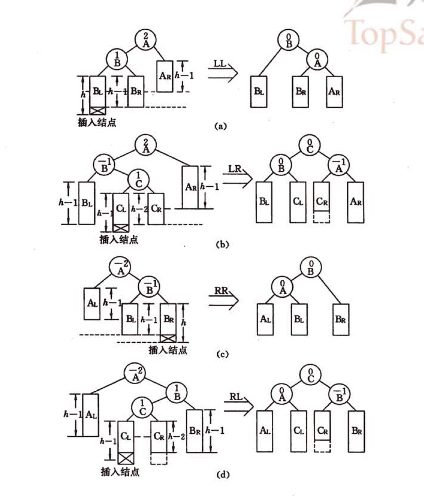

# 动态查找表

​		动态查找表的表结构本身实在查找过程中动态生成的，即对定值key，若key存在在成功返回，否则插入关键字等于key的记录。

## 一、二叉排序树与平衡二叉树

### 1.二叉排序树

**二叉排序树**的特点是：若二叉树不为空则

- 左子树不为空则左子树的所有结点的值均小于根节点的值。
- 右子树不为空则右子树的所有结点的值均大于根结点的值。
- 左右子树均为二叉排序树。

显然，二叉排序树的中序遍历是key值的游戏小至大的有序序列。二叉排序树的查找算法如下

```c
BiTree SearchBST(BiTree T, KeyType key){
    if(!T || EQ(key, T->data.key)) return T;
    else if(LT(key, T->data.key)) return SearchBST(T-<lchild, key);
    else  return SearchBST(T-<rchild, key);
}
```

### 2.二叉排序树的插入和删除

​		在查找过程中，当树中不存在对应结点时需要插入新结点，且新结点一定是叶子结点。(这里可以理解为树中每个结点实际上是一个区间的分割点，最小区间的分割点即是叶子节点。当要对一个区间进行分割时，就是这个结点的子节点。新结点一定是对原有的一个最小区间进行分割，即是该叶子结点的子结点，即新的叶子结点。)

```c
bool SearchBST(BiTree T, KeyType key, BiTree f, BiTree &p){
    //f表示T的双亲，初始值为NULL
    //若查找成功则p表示对应结点，否则表示查找路径上访问的最后一个结点。
    if(!T) {
        p = f;
        return false;
    }
    else if(EQ(key, T->data.key)){
        p = f;
        return true;
    }
    else if(LT(key, T->data.key)) SearchBST(T-<lchild, key, T, p);
    else  return SearchBST(T-<rchild, key, T, p);
}

bool InsertBST(BiTree &T, ElemType e){
    if(!(SearchBST(T, e.key, NULL, p))){//查找成功插入e
        s = (BiTree)malloc(sizeof(BiTreeNode));
        s->data = e;
        s->lchild = s->rchild = NULL;
        if(!p) T = s;//空树则s为根结点
        else if(LT(e.key, p->data.key)) p->lchild = s;
        else p->rchild = s;
        return true;
    }
    else return false;//查找成功则不再插入
}
```

​		删除一个结点需要分情况讨论：假定待删除结点为p，其父节点为f，不是一般性，令p为f 的左孩子结点

- p为叶结点，删除p，修改f的双亲即可。
- p只有左子树或右子树，令其子树为f的左子树即可。
- p同时有左右子树，则令s为二叉排序树中序遍历的直接前驱，则可令p的左子树为f左子树，p右子树为s的右子树。也可以让s取代p的位置，并将s的左子树作为s父节点的右子树。

```c
int DeleteBST(BiTree &T, KeyType key){
    if(!T) return 0;
    else{
    	if(EQ(key, T->data.key)) return Delete(T);
        else if(LT(key, T->data.key)) return DeleteBST(T->lchild, key);
        else return DeleteBST(T->rchild, key);
    }
}

int Delete(BiTree &p){
    if(!p->rchild){//只有左子树
        q = p;
        p = p->lchild;
        free(q);
    }
    else if(!p->lchild){//只有右子树
        q = p;
        p = p->rchild;
        free(p);
    }
    else{
        q = p;
        s = p->lchild;
        while(s->rchild){
            q = s;
            s = s->rchild;
        }//s为被删除节点的前驱，q为s的父节点
        p->data = s->data;//s取代q的位置
        if(q != p) q->rchild = s->lchild;
        else q->lchild = s->lchild;
        delete s;
    }
    return 1;
}
```

### 3.二叉排序树的查找分析

假设$P(i)$表示在有$i$个结点的二叉排序树的平均查找长度，则
$$
P(n, i) = \frac{1}{n}(1 + i(P(i)+1) + (n - i -1)(P(n - i - 1)+1))
$$
解得
$$
P(n) = 2(1 + \frac{1}{n})(\frac{1}{2} + \frac{1}{3} + \cdots+ \frac{1}{n})+\frac{2}{n} - 1\\
\le 2(1 + \frac{1}{n})ln(n)(n\ge 2)
$$

### 4.平衡二叉树

平衡二叉树(AVL树)的特点是：非空平衡二叉树的左右子树都是平衡二叉树，且它的左右子树的深度之差的绝对值小于1。若将一个结点的平衡因子定义为其左子树深度减去右子树深度，则其平衡因子只能为1，0，-1。

插入节点后，AVL树失衡的情况如图,其中啊a, b, c, d分别对应单向右旋平衡，双向旋转(先左后右)，单向左旋平衡，双向旋转(先右后左)。



平衡的二叉排序树BBST上插入一份新元素e的算法为：

1. 若BBST为空树则插入一个数据元素为e的结点作为BBST的根，树的深度加1。
2. 若e的关键字和BBST根节点关键字相同则不进行插入；
3. 若e的关键字小于BBST根节点关键字，而且BBST左子树中不存在和e相同关键字的结点，则将e插入在BBST左子树上并使其深度加一，
   1. 若BBST根节点的平衡因子为-1，则将根节点平衡因子+1，树深度不变；
   2. 若BBST根节点的平衡因子为0，则将根节点平衡因子+1，树深度+1；
   3. 若BBST根节点的平衡因子为1，若BBST左子树根节点的平衡因子为1，则需要单向右旋平衡处理，并在右旋处理之后，将根结点和其右子树根结点的平衡因子更改为0，树深度不变；若BBST左子树根节点的平衡因子为-1，则需要先进行向左后向右的双向旋转平衡，并修改根结点和其左右子树根结点的平衡因子。
4. 若e的关键字大于BBST根节点关键字，操作类似

```c
typedef struct BSTNode{
    ElemType data;
    int bf;//平衡因子
    struct BSTNode *lchild, *rchild;
}BSTNode, *BSTree;

#define LH 1 //左高
#define EH 0 //等高
#define RH -1//右高
void R_Rotate(BSTree &p){
    lc = p->lchild;
    p->lchild = lc->rchild;
    lc->rchild = p;
    p = lc;
}

void L_Rotate(BSTree &p){
    rc = p->rchild;
    p->rchild = rc->lchild;
    rc->lchild = p;
    p = rc;
}

int InsertAVL(BSTree &T, Elemtype e, bool &taller){
    if(!T){
        T = (BSTree)malloc(sizeof(BSTNode));
        T->data = e;
        T->lchild = T->rchild = NULL;
        T->bf = EH;
        taller = true;
    }
    else{
        if( EQ(e.key, T->data.key)){
            taller = false;
            return 0;
        }
        if(LT(e/key, T->data.key)){//应继续在左子树搜索
            if(!InsertAVL(T->lchild, e, taller)) return 0;
            if(taller){
                switch(T->bf){
                    case LH:
                        LeftBalance(T);
                        taller = false;
                        break;//原本左子树高，需要平衡，平衡后左右子树等高。
                    case EH:
                        T->bf = LH;
                        taller = true;
                        break;//原本等高，现左子树高。
                    case RH:
                        T_>bf = EH;
                        taller = false;
                        break;//原右子树高，添加后左右子树等高。
                }
            }
        }
        else{
            if(!InsertAVL(T->rchild, e, taller)) return 0;
            if(taller){
                switch(T->bf){
                    case RH:
                        RightBalance(T);
                        taller = false;
                        break;//原本右子树高，需要平衡，平衡后左右子树等高。
                    case EH:
                        T->bf = RH;
                        taller = true;
                        break;//原本等高，现右子树高。
                    case LH:
                        T_>bf = EH;
                        taller = false;
                        break;//原左子树高，添加后左右子树等高。
                }
            }
        }
    }
}

void LeftBalance(BSTree &T){
    lc = T->lchild;
    switch(lc->bf){
        case LH:
            T->bf = lc->bf = EH;
            R_Rotate(T);
            break;
        case RH:
            rd = lc->rchild;
            switch(rd->bf){
                case LH:T->bf = RH; lc->bf = EH; break;
                case EH:T->bf = lc->bf = EH; break;
                case RH: T->bf = EH; lc->bf = LH; break;
            }
            rd->bf = EH;
            L_Rotate(T->lchild);
            R_Rotate(T);
    }
}
```

## 二、B-树和B+树

### 1.B-树及其查找

一颗m阶的B-树，或为空树，或为满足下列特性的m叉树

1. 树的每个结点至多有m棵子树；

2. 若根结点不是叶子节点则至少有两颗子树；

3. 除根之外的所有非叶子结点至少有[m/2]棵子树；

4. 所有非终端结点包含下列信息数据
   $$
   (n,A_0,K_1,A_1,K_2,A_2,\cdots,K_n,A_n)\\
   K_i为关键字，K_i<K_{i+1},A_i为指向子树根结点的指针，且A_{i-1}所指子树中所有节点关键字均小于K_i且大于K_{i-1}
   $$

5. 所有叶子结点都出现在同一层次上并不带信息。

```c
#define m 3
typedef struct BTNode{
    int ktynum;//结点中关键字个数
    struct BTNode *parent;//双亲结点
    KeyType ket[m+1];//关键字向量，0号未用
    struct BTNode *ptr[m+1];//子树指针向量
    Record *recptr[m+1];//记录指针向量，0号未用。
}BTNode, *BTree;

typedef struct {
    BTNode *pt;//指向找到的结点
    int i;//在结点中关键字序号
    int tag;//是否成功 1表示成功，0表示失败。
}Result;

Result SearchBTree(BTree T, KeyType K){
    //在m阶B-树查找关键词K，若成功则tag=1，指针pt指向的结点中第i个关键字为K。
    //否则tag=0，等于K的关键字应插在pt所指的结点的第i个与第i+1个关键字之间。
    p = T;
    q = NULL;//记录父节点信息
    found = false;
    i = 0;
    while(p && !found){
        i = Search(p, K);//在p->key中寻找i使得p->key[i]<=K<p->key[i+1]
        if(i > 0 && p->key[i] == K) found = true;
        else{
            q = p;
            p = p->ptr[i];
        }
    }
    if(found) return(p, i, 1);//成功返回对应结果
    else return(q,i,0);//失败返回K的插入信息
}
```

查找分析：对m阶B-树，第一层至少有1个结点第二层至少有2个结点，第三层至少有2[m/2]个结点，依次类推，叶子结点个数为N则
$$
N+1\ge 2*([m+1])^{l-1}即\\
l\le log_{[m/2]}(\frac{N+1}{2})+1\\
即查找路径结点数不超过log_{[m/2]}(\frac{N+1}{2})+1
$$


### 2.B-树的插入和删除

结点插入时首先要在最低层的某个非叶子节点添加一个关键字，若该节点的关键字个数不超过m-1则插入完成，否则需要产生结点的分裂。

结点分裂的算法如下：

​		将结点中信息均分，将前一半信息保留，后一半信息由新结点p‘保存，将分裂边界点的信息以及p’插入其父节点中。

```c
int InsertBTree(BTree &T, KeyType K, BTree q, int i){
    x = K;
    ap = NULL;
    finished = false;
    while(q && !finished){
        Insert(q, i, x, ap);//将x和ap分别插入 q->key[i+1]和q->ptr[i+1]
        if(q->keynum < m) finished = true;
        else{
            s = (m % 3 == 0)? m/2: (int)m/2 + 1;//向上取整
            split(q, s, ap);//分裂结点q，ap_>recptr存储q->recptr[s+1,...m]
            x = q->key[s];
            q = q->parent;
            if(q) i = Search(q, x);//在q双亲中查找x的插入位置
                
        }
    }
    if(!finished) NewRoot(T, q, x, ap);
    return 1;
}
```

删除关键字时，若被删除字所在结点中的关键字数目不小于[m/2]，则只需删除对应关键字与指针；否则，需要对结点进行合并操作：

1. 与该节点相邻的左（右）兄弟结点中关键字数目大于[m/2]-1，需将其兄弟结点中最小(最大)的关键字移至双亲结点中，并将双亲结点中小于(大于)且紧靠上移关键字的关键字移至被删关键字的结点中。
2. 若该节点的左右兄弟结点中的关键字均等于[m/2]-1，假设其有右兄弟结点，在父节点中指针为$A_i$所指，则将该结点的所有关键字与指针以及父节点中$A_i,K_i$一同合并至其右兄弟结点中。

### B+树

B+树的特点为：

1. 有n棵子树的结点中含有n个关键字；
2. 所有叶子结点包含了全部的关键信息以及指向含有这些关键字记录的指针，且叶子节点本身依关键字的大小顺序链接。
3. 所有非终端结点可以看成索引部分，结点中只有其子树中最大(或最小)关键字。

通常在B+树上有两个头指针，一个指向根结点，一个指向关键字最小的叶子结点；因此，B+树通常由两种查找运算：一种时从最小关键字起顺序查找，一种时从根结点开始进行随机查找。

## 三、键树

键树又称数字查找树，是一颗度$\ge2$的树，树中每个结点中不是包含一个或几个关键字而是组成关键字的符号，若是数值则结点中只包含一个数位；若是单词则只包含一个字母字符。（类似于前缀匹配）

约定键树是有序树，同一层中兄弟节点之间所依存的符号从左至右有序并约定结束符$小于任何字符。

#### 1. 键树的存储表示--树的孩子兄弟链表

每个分支节点包含三个域：symbol域存储一个关键字的字符；first域指向第一棵子树的根；next域存储指向右兄弟结点的指针。

查找算法如下：假设给定值为K.ch(0..num-1)，其中K[0]至K[num-2]表示num-1个字符，K[num-1]为结束符$。从树的跟指针出发，顺first指针找到第一棵子树的根结点，以K[0]与该结点symbol域比较，若相等则顺first域比较下一个字符，否则沿next域顺序查找。若为空仍不等则查找失败。

```c
#define MAXKEYLEN 15
typedef struct{
    char ch[MAXKEYLEN];
    int num;
}KeysType;
typedef enum {LEAF, BRANCH} NodeKind;

typedef struct DLTNode{
    char symbol;
    struct DLTNode *next;//指向兄弟结点
    NodeKind kind;
    union{
        Record *infoptr;//叶子结点的记录指针
        struct DLTNode *first;//分支节点的孩子节点
    }
}DLTNode, *DLTree;

Record *SearchDLTree(DLTree T, KeysType K){
    p = T->first;
    i = 0;
    while(p && i < K.num){
        while(p && p->symbol != K.ch[i]) p = p->next;
        if(p && i < K.num - 1) p = p->first;
        ++i;
    }
    if(!p) return NULL;
    else return p->infoptr;
}
```

假设键树每个结点最大度为d，深度为h；假设关键字中字符的个数相同，则平均查找长度为h(1+d)/2。

插入或删除一个关键字相当于插入或删除一颗子树。

### 2.键树的存储表示--多重链表

树的每个结点中含有d个指针域，此时键树又称Trie树，若从键树中某个结点都叶子节点的路径上每个结点都只有一个孩子，则可将路径上所有结点压缩成一个叶子结点并包含关键字和记录指针等内容。

查找思路为：从根结点出发，沿和给定值相应的 指针象行直至叶子结点，若叶子结点的值与给定值相同则查找成功。

```c
typedef struct TrieNode{
    NodeKind kind;
    union{
        struct{KeyType K; Record *infoptr} lf;//叶子结点
        struct{TrieNode *ptr[27]; int num} bh;//分支结点
    }
}TrieNode, *TrieTree;

Record *SearchTrie(TrieTree T, KeyType K){
    for(p = T, i= 0;
       p && p->kind == BRANCH && i <K.num;
       p = p->bh.ptr[ord(K.ch[i])], ++i);
    if(p && p->kind == LEAF && p->lf.K == K) return p->lf.infoptr;
    else return NULL;
}
```

