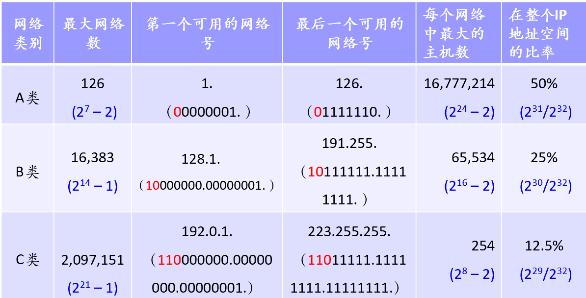
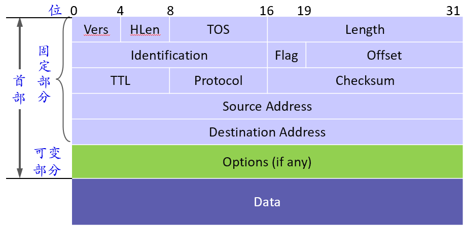
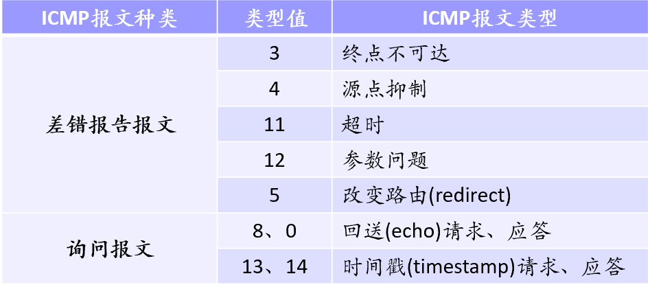
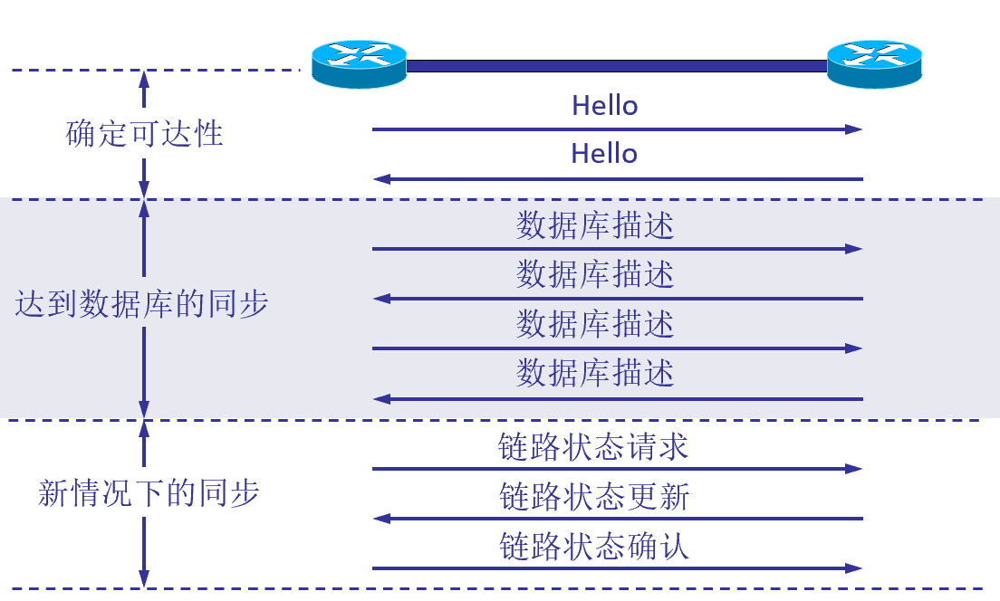
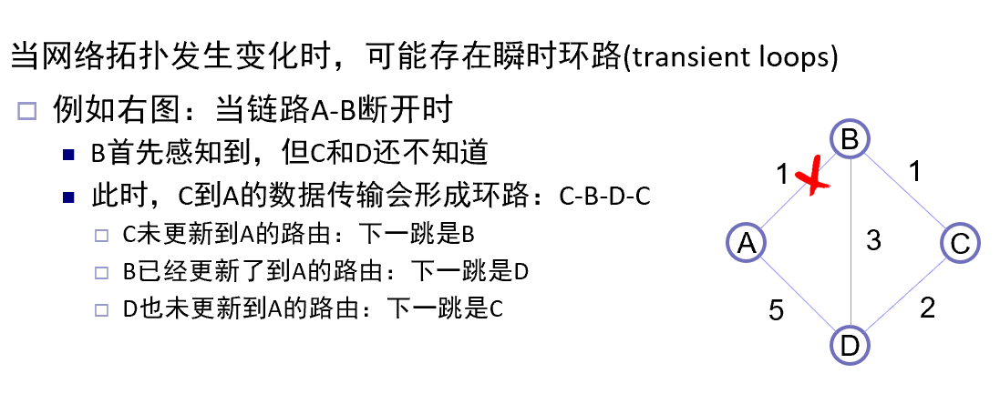
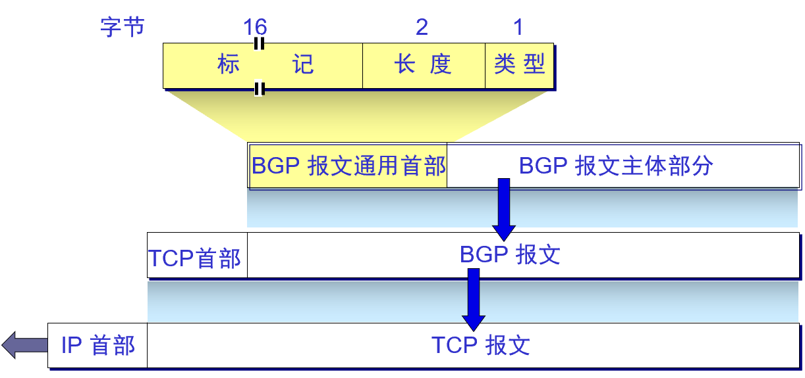

# 第四章 网络互连

交换网络存在问题：扩展能力有限，存在多种类型的异构网络。

## 一、网际协议IP

****

### 1. IP概述

ip为无连接的，尽最大努力交付的传输服务；

网络层的功能：

1. 转发：分组到达路由器的一条输入链路时，路由器将分组移动到适当的输出链路；（动作， 局部）
2. 路由选择：分组从源结点(发送方)流向接收方(目的结点)时，网络层必须决定这些分组所采用的路由或路径。（决策，全局）

相关协议：路由选择协议，ARP协议，ICMP协议，IP多播。

### 2.IP编址（IPv4）

#### 2.1 分类的IP地址

IP地址 = 网络号 + 主机号

IP地址分为A，B，C，D，E五类地址，A，B，C为单播地址，D为组播地址，E为保留地址。

网络号全0的ip地址保留，网络号全1的ip地址保留为环回地址。

主机号全0的ip地址为“网络地址”，全1的ip地址为该网络内所有地址，即广播地址。

**IP地址的特点**：

1. IP地址为两级的层级结构，方便ip地址管理，减少路由表存储空间；
2. IP 地址实际标识的是一个结点和一条链路的接口；当一个结点同时连接值两个网络上时，必须有两个网络号不同的ip地址。
3. 同一网络上的结点的IP地址的网络号必须相同。
4. 所有分配到网络号的网络都是平等的。

### 3.IP的分组转发

路由器将转发信息存储在转发表(FIB)中，FIB存储这网络号与下一跳地址的映射关系。

分组转发的规则：

1. 从数据包的首部中提取主机的IP地址D，得到目的网络地址N；
2. 若N时与此路由器直接相连的某个网络地址，则把数据包直接交付给目的主机D;否则是间接交付，执行(3).
3. 若FIB表中有目的地址为D的特定主机路由，则把数据包传给路由表中所指明的下一跳路由器，否则，执行(4)。
4. 若FIB表中有到达网络N的路由，则把数据包传给路由表知名度下一跳路由器；否则，执行(5)。
5. 若FIB表中有默认路由，则把数据包交给路由表中所指明的默认路由器；否则，执行(6)。
6. 报告转发分组出错。(ICMP，目的不可达)。

### 4.地址解析协议ARP

ARP功能：根据目的主机的IP地址，查询其硬件地址。

每个三层结点中方都有一个ARPCache，存储结点所在的局域网内各节点的IP地址到其硬件地址的映射表

**ARP工作原理**：当结点A向局域网内另一结点B发送IP报文：

1. 在其ARP Cache中查看有无B的IP地址，有则查出对应的MAC地址，将其写入MAC帧，通过局域网发送该硬件地址；
2. 否则，A向局域网内广播ARP请求，查询B的IP地址：
   1. B收到该请求后，单播自己的MAC地址
   2. A和B都会将对方的地址映射写入ARP Cache；
   3. 其他结点会查询自己的ARP Cache中是否有A的硬件地址，有则更新老化时间，没有则写入。

### 5.IP报文格式

IP数据报由首部与数据两部分组成：首部包含固定部分(20字节)以及可选字段；分组格式为32bits对其；

### 6.IP分片

不同网络中MTU不同，当分组网络经历的网络MTU比分组小时，路由器将分组分片后放进物理帧。

每片的长度为8的倍数且包含一个ip数据头。

IP报文中三个字段与分片有关：

1. identification：产生IP数据报的标识号，IP的分片与原始数据相同。
2. Flag：MF置1表示后面还有分片，置0表示最后一个分片；DF置0表示允许分片；
3. Offset：指明分片在分组中的位置，以8字节为偏移单位，原因是IP数据长度为16bits，而offset为13bits，为使得offset能够表示所有数据，偏移的长度为2^16/2^13 = 8字节。

## 二、划分子网与构建超网

****

原本IP设计的问题：

1. IP地址利用率低；
2. 每个物理网络分配一个网络号使得路由表过大；
3. 使用不灵活；

### 1.划分子网

通过向主机号借位作为子网号，不改变网络号的前提下使得IP地址变为IP地址 = 网络号+子网号+主机号。(子网号规定不能全1或全0，因此借位至少为2位。)

**子网掩码**：子网掩码与IP地址逐位相与得到子网的网络号。

**如何划分子网**：

1. 确定默认掩码，确定主机号位数；
2. 根据需要划分的子网数以及每个子网的主机数确定借位数；
3. 给出子网掩码；
4. 给出每个子网的地址范围(主机号，子网号不能全0全1)。

划分子网后，路由器FIB表中对每个网络地址添加子网掩码。

### 2.构造超网

无分类域间路由(CIDR)：地址分类无严格界限，网络号为可变长；

IP地址 = 网络前缀 + 主机号；使用“斜线记法”(CIDR记法)，即在IP地址后加一个"/"，写上网络前缀所占位数。

使用CIDR时，查找路由表会得到不止一个匹配结果，从匹配结果中选择具有最长网络前缀的路由的方法称为**最长前缀匹配**。

## 三、网络控制与诊断--ICMP协议

****

用于网络诊断和控制：主机或路由器用于报告差错异常等情况；IP层协议，封装在IP数据报中。

ICMP报文分为差错报文与询问报文。

应用：

1. PING：发送请求和应答报文。
2. Tracerout/Tracert：第一个分组TTL设为1，第二个设为2，以此类推，根据超时报文可得路径。
3. 路径MTU发现：源主机向目的主机连续发送多个长度不同的报文并禁止分片，若超过MTU路由器会返回“终点不可达”。

## 四、IP路由协议

****

### 1.路由器工作原理

路由器的功能为转发分组：将路由器某个输入端口收到的分组按照分组要去的目的地（目的网络），把该分组从某个合适的输出端口转发给下一跳路由器直至分组到达。

### 2.路由协议的基本概念

路由选择算法：为任意两个结点找到一个开销最小的路径。

路由选择协议分为域内路由与遇见路由，原因是Internet规模大且有管理自治的需要。

### 3.内部网关协议RIP

分布式基于距离向量算法的路由选择协议，要求网络中每个路由器都要维护他自己到其他每个目的网络的距离记录：

1. 通过仅与相邻路由器交换本路由器所知道的全部路由信息；
2. 固定时间间隔或一个结点的路由表改变时就给其他相邻节点发送消息。

**距离向量迭代算法**：

1. 任何时刻，每个结点保存到目的结点的已知最优路径的开销和对应下一跳结点；如果不可达，则用∞表示。
2. 初始化：每个结点构造一个包含到所有其他结点的距离的向量，初始化时仅有相邻节点的信息并将自己的整个向量发送给相邻节点。
3. 迭代，距离向量更新：收到相邻节点的消息后，比较选择更优的开销与下一跳结点，更新自己的向量；若更新则向邻居节点发送。

距离的定义：RIP中距离定义为跳数，最大为15，超过15视为不可达。

故障链路将距离定义为∞。

存在问题：Count-to-Infinity:对故障链路，网络收敛变慢。(路由中存在环路)

解决方法：水平分割，从相邻结点学到的信息不会发送回原结点；反向抑制加入否定信息使得相邻结点不会使用从它们那里学到的信息。(本质上都在减少路由中路由更新中的环路的形成)。

**RIP协议**：

报文：请求，命令位置为1，由刚启动的路由器或某些记录超时的路由器发出；应答，命令位置为2，答复一个请求或每隔30s发出。

工作流程：

1. RIP刚启动时，检测路由器各个接口的状态与地址信息；若接口状态正常则在路由表中增加一条路由，表示可以到达该接口所在的网络。
2. 初始化后，主动向各个网络接口以广播的形式发送RIP请求。
3. 收到请求的路由器回复应答包。
4. 最后，各个相邻结点之间交换路由信息，个结点获得全网路由信息。

路由表的更新：

​	收到地址为X的RIP报文时，修改RIP报文中所有项目，下一跳地址设为X，距离加一；

​	从无到有：若项目中目的网络不在路由表中则加入路由表；

​	新优先：若项目中目的网络在路由表中且下一跳地址为X，则用新项目替换原项目；

​	短优先：若项目中目的网络在路由表中，下一跳地址不为X且新项目中距离小于原项目中的距离，则进行更新；

**RIP的局限**：可扩展性一般，不能在丢失率高的网络中使用，不能使用时延、负载

等为依据选择路由，开销较大，收敛速度慢。

### 4. 内部网关协议OSPF

OSPF协议中，各个节点从域内所有节点获取信息构建链路状态数据库，各个结点只发送与本路由器相邻的路由器之间的链路状态。各个结点根据自己的链路状态数据库根据Dijkstra算法单独计算它到其他结点的最短路径，生成以自己为根的树形结构。

链路状态：链路数据库 的条目，包括接口的IP地址，掩码，链路类型，到连接路由器的开销等信息。

**构建网络拓扑**：

1. 链路状态通过链路状态分组ISP传播，包含创建该LSP的结点标识，该节点的相邻节点列表和链路开销，序列号，生存期。
2. 每个结点在超时或与其直接相邻的结点或链路发生故障，拓扑结构变化时发送ISP。
3. 可靠扩散链路状态信息：结点收到LSP副本后，若之前没有保存对应ID的LSP，则保存，若之前有保存但新LSP的序列号更大，则更新。在保存或更新后向源结点以外的所有节点继续扩散并通过确认和重传保证可靠性。
4. 新旧信息替换：产生新LSP时序列号加一，收到LSP在扩散至邻居时TTL减一。

**路由计算**：

N := 所有节点的集合；

l(i, j) := 结点i, j之间的；链路开销，若i, j 不可达则为∞；

M := 结点子集，包含所有被选中的结点；

C(n) := 源结点到结点n的开销；

s := 源结点；

M = {s}

for n in N - {s}:

​	C(n) = l(s, n)

while(N != M):

​	M = M ∪ {w}使得C(w)对(N - M)中所有节点而言是最小的

​	for n in (N - M):

​		C(n) = min( C(n), C(w) + l(w, n))

**OSPF区域划分**

OSPF协议将网络分割为若干独立的区域，每个区域有一个32位的区域标识符，上层的区域称为主干区域，标识符规定为0.0.0.0，作用是联通其他下层区域。

区域内每个结点计算到其他域内所有结点的路由路径；区域为结点只需知道到其他区域的路径。

边界路由器汇总一个区域中了解到的所有路由信息，通过主干区域通知给其他区域的边界路由器；跨区域分组传输：非主干网->主干网->非主干网。

**OSPF的五种分组类型**：

1. HELLO分组：发现邻接路由器，建立和维持关系。
2. 数据库描述分组：描述发送者当前拥有的所有链路状态数据库内容的摘要信息，在初始化邻接关系是交换。
3. 链路状态请求分组：向对方请求发送某些链路状态项目的详细信息，在发现部分数据库内容过期后发送。
4. 链路状态更新分组：发送新的链路状态信息，用于对链路状态请求分组的回应，也用于通过洪泛法向全网更新链路状态。
5. 链路状态确认分组：确认链路状态更新报文。

**距离向量与链路状态算法比较**

|                  | 距离向量                                       | 链路状态算法                                       |
| ---------------- | ---------------------------------------------- | -------------------------------------------------- |
| 路由信息扩散范围 | 相邻节点间交换信息                             | 所有节点间交换信息                                 |
| 路由信息内容     | 发送结点所知道的全部信息（自己整个路由表信息） | 仅发送结点确切知道的信息（与其直接相邻的链路状态） |
| 空间开销         | 只保存邻居距离信息                             | 保存全网拓扑信息                                   |
| 收敛速度         | 较慢                                           | 较快                                               |
| 可扩展性         | 较差                                           | 较好                                               |
| 路由环路         | 可能会出现环路，Count-to-Infinity              | 可能出现短暂环路                                   |
| 路由协议         | RIP                                            | OSPF                                               |

**短暂环路**：

### 5.外部网关协议BGP

不同自治系统的路由器之间交换路由信息的协议，力求寻找一条能够到达目的网络且比较好的路由而非最佳路由。

**BGP发言人**：AS的管理员至少选择一个路由器作为"BGP发言人"，一般是边界路由器，不同AS的BGP发言人建立**TCP连接**，在此连接上交换BGP报文建立BGP会话，交换路由信息。

**路径向量**：每个路由更新中携带整条路径信息(路径值途径AS的集合)，当收到至某AS X的路由通告，根据本地策略选择到X较好的路径，并决定向哪些AS通告该路由的更新。

**检查环路**：当AS收到路由更新消息后，检查自己是否在对应环路中：如果在，存在环路，丢弃该消息；不在，则将自己添加在路径中并通告该路由更新。

优点：度量指标不需要统一，AS可根据自己的策略选择路径，可以避免环路。

**BGP报文格式**：

**BGP报文类型**：

1. 打开报文：与相邻的另一个BGP发言人建立关系。
2. 保活报文：向对等点周期性发送，保证连接不断开。
3. 更新报文：发送路由更新信息以及列出要撤销的路由。
4. 通知报文：发送检测到的差错。

## 五、IP多播

基于多播组的多对多，一对多传输模式。每个多播组都有自己的IP多播地址。（主机发送一个分组至多播地址时，相关的多播路由器负责复制转发至其所有组成员）

IP多播的最后阶段，可能需要硬件多播实现：当多播组进入某局域网时，若该局域网内部存在对应的多播组的多个成员，可通过硬件多播将这些数据交付给组成员。

**网际组管理协议IGMP**：让连接在本地局域网上的多播路由器知道本局域网上是否有主机参与或退出了某个多播组。（基于IP协议）

1. 主机加入某个多播组时，该主机向多播组的多播地址发送IGMP报文声明自己要称为该组的成员，本地多播路由器收到IGMP报文后，利用多播路由选择协议把这种组成员关系发送给互联网上其他多播路由器。
2. 多播路由器确认本地的组成员关系：本地路由器周期性试探本局域网上的主机以便知道这些主机是否继续是组的成员；只要某个组有一个主机响应，便认为这个组是活跃的，但多次探询后没有主机响应则不再将该组的成员关系转发给其他多播路由器。

**多播路由选择协议**：多播路由器之间通过协同工作，把多播组用最小代价传送给所有组成员。

## 六、VPN

因特网中所有路由器对目的地址是私有地址的分组一律不转发，使用私有地址进行通信需要IP隧道技术实现的虚拟专用网(VPN)。

通信时，私有地址的通信被作为DATA部分加密封装。IP分组的源，目的地址为公有地址。

## 七、网络地址转换NAT

NAT负责私有地址与全局地址之间的翻译。NAT拥有至少一个有效的全局IP，会将私有地址转换为NAT拥有的全局IP地址与互联网其他主机通信。