# 第五章 端到端传输

传输层实现端系统上运行的应用进程间的逻辑通信，即端到端传输。

## 1. 传输层协议概述

传输层实现应用进程间的端到端通信，是面向通信部分的最高层，也是用户功能中最底层。

传输层的两个主要协议：

1. 用户数据包协议UDP：

   端到端的，尽力而为的数据报传输服务；简单的异步多路分解与复用：所有应用进程的数据通过传输层传输到IP层即多路复用，传输层收到的数据交付给相应的应用进程即多路分解。

2. 传输控制协议TCP：

   -09876554端到端的、可靠的、面向连接的字节流服务：

   多路分解与复用；

   连接管理：先建立逻辑连接，进行双向数据流传输，通信结束后撤销连接；可靠传输：对一个连接上传输的每个字节编号，通过接收确认与重传来保证可靠传输；

   流量控制：防止发送方发出的数据超过接受方的接收能力；

   拥塞控制：防止过多数据注入网络造成网络节点或链路超载。

**多路分解与复用**：

传输层采用抽象定位符端口，使得进程间能够间接互相识别：源进程向源端口发送消息，目的进程从目的端口接收消息。

端口为抽象的软件端口，一般由消息队列实现；

端口分为三类：

1. 熟知端口：0-1023，每个服务器进程在某个固定的熟知端口接收消息。例如FTP端口为21，SMTP端口为25，DNS端口为53，TFTP端口为69，HTTP端口为80，SNMP端口为161.
2. 登记端口号：1024-49151，供服务提供商使用，需在IANA登记。
3. 客户端口号：49152-65535，供客户端使用，动态选择。

## 二、用户数据报协议UDP

### UDP协议的特点：

无连接的，无需建立连接，无需维护状态；

尽最大努力交付，不保证可靠传输；

没有拥塞控制；

支持一对一，一对多，多对一和多对多的交互通信；

面向报文的，在IP的功能上简单扩展到端到端：发送方对应用进程交付下来的报文，添加UDP首部后直接交付IP层，接收方对IP层交上来的UDP用户数据报，去除首部后原封不动交付上层应用进程；

作为最基本的传输层协议，上层可以实现更多功能，按需定制；

### UDP首部格式

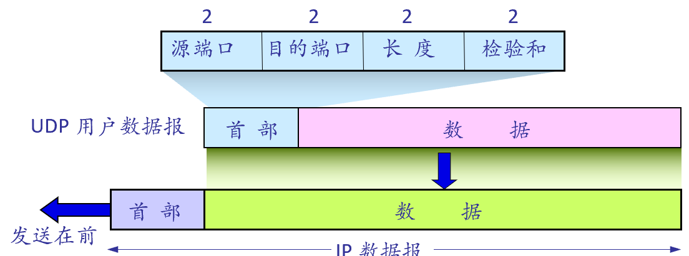

校验和计算：

IP的源IP地址，目的IP地址，0，17，UDP长度作为伪首部进行校验和计算：8位做二进制反码运算后将结果求反码。

## 二、传输控制协议TCP

### 1.TCP报文格式

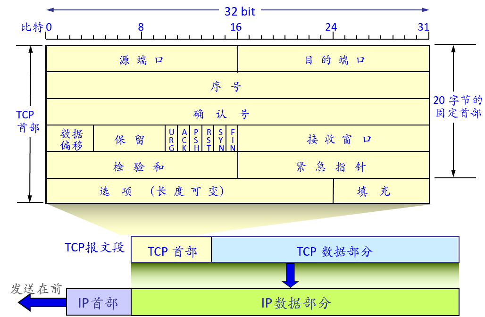

源端口，目的端口：各两字节，分别写入源，目的端口号；

<源端口， 源IP，目的端口，目的IP>四元组是每个TCP连接的唯一标识符。

序号：4字节，TCP连接中传送的数据流中的每个字节都按顺序编上一个序号，序号字段的值则是**本报文段所发送的数据的第一个字节的序号**。

确认号：4字节，只期望收到对方的下一个报文段的数据的第一个字节的序号；若确认号为N，则表明序号到N-1为止的所有数据都已正确接收。

数据偏移/首部长度：4bits，TCP报文段的数据起始处到TCP报文段起始处的偏移，单位为4字节。

URG：置1时表示本报文包含紧急数据。紧急指针指明报文段中非紧急数据从什么地方开始，紧急数据在报文数据段前部。

ACK：仅当该标志位置1时，**确认号字段**有效。

PSH：该标志位置1时，说明发送方调用PUSH操作，接收方应尽快交付给接受应用进程。

RST：该标志位置1时，说明TCP连接出现了严重差错，必须释放链接，重新建立；也可以通过对该位置1拒绝一个非法的报文段或拒绝打开一个连接。

SYN：在建立连接时使用，置1表示这是一个连接请求/接受报文；ACK=0时表示连接请求，ACK=1时表示连接接受。

FIN：用来释放一个连接，置1表示此报文段的发送端数据已发送完毕，要求释放TCP连接。

接收窗口：2字节，指明该报文段发送者接收窗口大小，用于指示对端设置其发送窗口的大小；滑动窗口算法中用于流量控制。

校验和：2字节，计算整个TCP首部，TCP数据伪首部的校验和。(同UDP)

选项：最大40字节，最大报文段长度，窗口扩大选项，时间戳选项，选择确认选项等。

填充：使整个首部的长度是4字节的整数倍。

**多路复用**：源，目的端口；

**连接管理**：SYN，ACK，FIN，序号，确认号；

**可靠传输**：ACK，序号，确认号；

**流量控制**：接收窗口，选项；

**拥塞控制**：未在协议格式中体现。

### 3.TCP连接管理

连接是TCP最基本的抽象，每个TCP连接是一对双向的点对点字节流，端点为套接字(IP:port),两个端点组成的四元组为连接的唯一标识。

连接管理分为3个阶段：连接建立，数据传输，连接释放；

#### 3.1连接建立

连接建立的目的是使双方能够确认对方的存在，确认自己的初始序列号并通知对方，协商一些参数如最大报文段长度，最大窗口大小等，对传输实体资源进行分配如缓存大小，连接表中的其他项目。

TCP连接的建立采用客户-服务器方式：客户(client)是主动发起连接建立的应用进程，端口号由协议栈随机产生；服务器(server)是被动等待建立连接的应用进程，使用熟知端口号。

连接的建立是非对称的：服务器预先被动打开进入LISTEN状态；连接建立由客户端主动打开开始。

**三次握手**

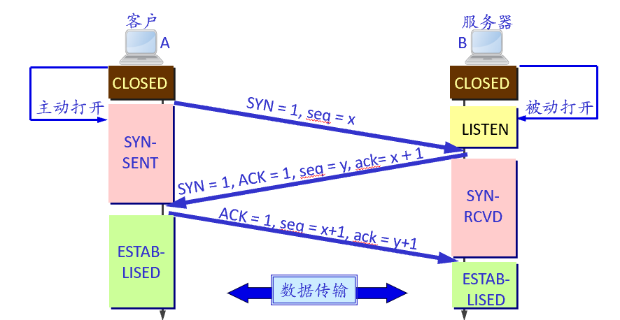

0. 开始时，双方都处于CLOSED状态。服务器进程B被动打开连接，进入LISTEN状态；
1. 客户端进程A主动打开链接：创建传输控制块TCB，向B发送连接请求并进入SYN-SENT状态；该过程中，SYN置1，选择发送方的初始序列号为x；SYN =1的报文不包含数据但消耗一个序号；
2. 服务器端收到请求后，应答确认报文，进入SYN-RCVD状态；
3. A收到B的确认后，向B应答确认并进入ESTABLISHED状态；B收到A的确认后，也进入ESTABLISHED状态。

**第三次握手的必要性**：为防止已失效的连接请求报文段突然传送到B产生错误。即A发送第一个丽娜姐请求未丢失但在某些网络结点中滞留了，以致延误到连接释放后的某个时间才到达B，B收到这个早已失效的请求后误以为A重新发起了一次新的连接请求，同意建立连接；此时B单方面建立起连接，A未建立连接也不会向B发送数据导致B的资源被浪费。

#### 3.2数据传输

特定序列号值的数据从发送方向接收方流动，每个字节按顺序编号，每个报文段中的序列号的值指的是本报文段所发送的数据的第一个字节的序号。

对数据的接收确认，接收窗口大小由接收方向发送方应答。

基于滑动窗口算法实现可靠的字节流传输：

- 何时发送一个报文段--触发重传
- 丢包检测与重传--自适应重传
- 发送速率不能超过接收方的接收能力--流量控制
- 尽可能多的利用网络带宽--拥塞控制、

#### 3.3连接释放

连接的任何一方都可以主动关闭连接，发送FIN报文段表示己方不再发送数据。而另一端可以继续发送数据，单向的数据传输仍需要接收方发送ACK报文。

异常情况下，任何一方都可以发送RST报文段关闭连接。RST连接关闭是双向的，而且不需要对端回复ACK。（异常情况通常有：1.客户端连接一个不存在的端口；2.数据包到达一个之前存在但现在已被本地进程或操作系统关闭的连接；3.某端发现连接对端的TCP空闲时间超长；4某端TCP出现了混乱情况）

**四次挥手**

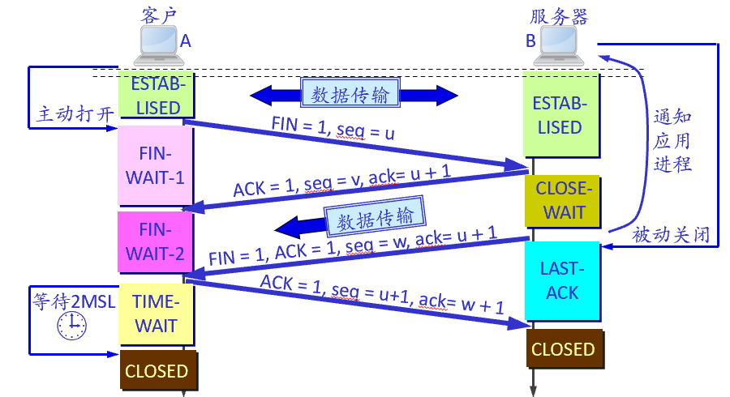

1. 开始时双方处于ESTABLISHED状态，假设A先传输完数据主动关闭TCP连接。A向B发送连接释放报文段进入FIN-WAIT-1状态；连接释放报文段FIN置1，消耗一个序号。
2. B收到A的连接释放报文段后，应答确认，进入CLOSE-WAIT状态。此时B通知高层应用进程，A到B的连接被释放。
3. A收到B的确认后，进入FIN-WAIT-2状态。此时B到A的连接并未关闭，若A收到B的数据仍需回复ACK。
4. 若B已没有向A发送的数据，其应用进程通知释放TCP连接；B向A发送连接释放报文段后，进入LAST-ACK状态。FIN，ACK置1，重复已发送过的确认号。
5. A收到B的连接释放报文段后，回复确认，进入TIME-WAIT状态；B收到A的确认后，撤销传输控制块，进入CLOSD状态；
6. A必须经过时间等待计时器设置的时间2MSL后进入CLOSED状态。

**为什么A需要在TIME-WAIT等待2MSL时间**：

1. 确保A发送的最后一个ACK能够到达B。

   ​	若这个ACK丢失，处在LAST-ACK状态的B收不到FIN+ACK报文的确认会超时重传，A可以在2MSL时间内收到重传的FIN+ACK报文段，重新启动计时器，最后都可以进入CLOSED状态；否则A收不到重发的报文，B因此无法进入CLOSED状态。

2. 防止已失效的连接请求报文段出现在本连接中。

   ​	A发送完最后一个ACK报文段后，再经过2MSL时间可以使本连接持续时间内产生的所有报文段都从网络中消失，从而使得下个新连接中不会出现旧的连接请求的报文段。

**为什么FIN/SYN需要占用序号**：

​		FIN/SYN需要对方进行收到确认，确认需要消耗序号。(任何需要确认的数据报都需要消耗序号)

**总结**：

- TCP传输总是需要确认的。
- SYN/FIN需要占用序号。
- 连接释放可以采用FIN/RST两种方式。
- TCP需要考虑报文丢失，设计重传机制。
- 连接释放需要重点考虑释放时机和完全释放的问题。

**TCP状态转移**

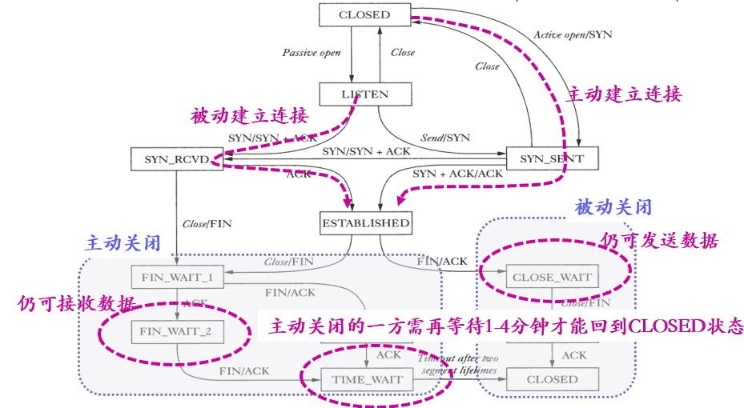

### 4.可靠有序传输

滑动窗口算法保障了数据的可靠有序传递，增强发送方对接收方的流量控制，实现网络拥塞控制。

**发送方TCP**：维护一个发送缓冲区

- 存储已被发送应用进程写入但尚未被发送的数据，已被发送但未被确认的数据。
- 维护三个指针：LastByteAcked，LastByteSent，LastByteWritten；LastByteAcked <= LastByteSent <= LastByteWritten
- 发送窗口：发送窗口上限MaxWindow = min(CongestionWindow, AdvertisedWindow),有效窗口EffectiveWindow = MaxWindow - (LastByteSent - LastByteAcked)

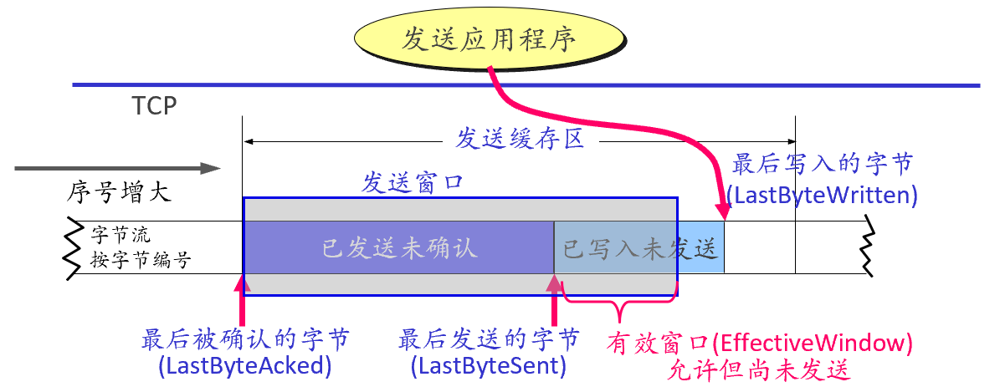

**接收方TCP**：维护一个接收缓冲区

- 存储已到达但未被应用进程读出的数据，包括按正确顺序已到达已确认，乱序到达未确认的数据
- 维护三个指针：LastByteRead，NextByteExpected，LastByteRecvd；LastByteRead < NextByteExpected < LastByteRecvd
- 接收窗口：根据本地缓存情况，确定AdvertisedWindow大小并通知发送方，实现流量控制；AdvertisedWindow = MaxRcvBuffer - ((NextByteExpected - 1) -LastByteRead) 

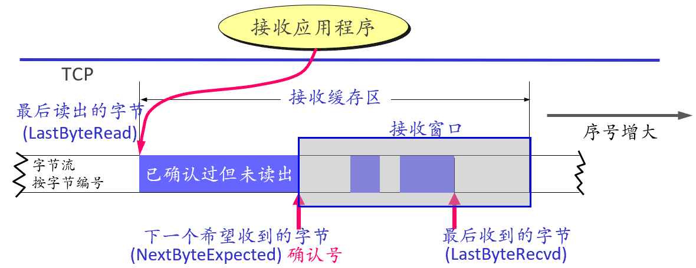

接收方需要对每个收到的数据进行确认，确认方法分为：

1. 累计确认：对按序到达的最后一个报文段进行确认，简单易实现，但发送方无法确认哪些报文丢失需重传。
2. 选择确认：确认收到的不连续的数据块边界，使用首部选项中SACK选项。

### 5.流量控制

目的：防止快发送方给慢接收方发送数据造成接受崩溃，缓冲区溢出。

原理：接收方根据缓存大小确定AdvertisedWindow并通知发送方，发送方根据AdvertisedWindow以及CongestionWindow确定发送窗口上限。

**接收方**：确定AdvertisedWindow的大小，必须保持LastByteRecvd – LastByteRead <= MaxRcvBuffer;

AdvertisedWindow = MaxRcvBuffer – ( (NextByteExpected – 1) - LastByteRead),代表缓冲区中剩余空间数量；新数据到达，NextByteExpected 指针右移，窗口大小可能变小。窗口大小取决于应用进程读取数据的速度与数据到达的速度的相对快慢。

**发送方**：根据AdvertisedWindow确定有效窗口，限定发送速率。

有效窗口(EffectiveWindow) = AdvertisedWindow – (LastByteSent - LastByteAcked)，有效窗口大于0才能继续发送数据。

可能情况：

- 发送方有效窗口为0；
- 报文段到达确认x字节，LastByteAcked右移x字节，但由于接收方进程未读取任何数据导致AdvertisedWindow 减少x字节，使得发送方虽然释放了x字节的缓冲区空间，仍然不能发送任何数据。

发送方还需保证发送缓冲区不溢出：发送进程试图向TCP写入y字节但LastByteWritten – LastByteAcked + y > MaxSendBuffer，此时TCP会阻塞发送进程不让其产生数据。

**慢接收进程对快发送进程进行监控**：

TCP仅在它有数据或有确认需要向对端发送时才会发送报文段，当AdvertisedWindow 为0时，A不再向B发送数据，B也不会向A发送确认报文，同时B没有数据需要向A发送，也不会发送数据报文；因此，当B的AdvertisedWindow 不为0时，没有机会通告A；A，B进入互相等待的死锁局面。

解决办法：发送方定期主动侦测。TCP为每个连接设置持续计时器，当发送方收到AdvertisedWindow 为0的报文时开始计时；计时器到期后发送零窗口探测报文(仅携带1字节数据)，对方确认该报文并给出当前窗口值，若为0则重新计时，不为0则开始发送。

P.S.TCP被设计成使接收方尽可能简单，主要依靠发送方解决问题。即“聪明的发送方/笨拙的接收方(smart sender / dumb receiver)”规则

**AdvertisedWindow**字段大小应该足够大以保证广域网中时延带宽积较大的管道满载。(这类管道被称为长肥管道)。在100msRTT下，网络的时延带宽积普遍在几百KB即数MB之间，而16位字段大小仅允许64KB的通知窗口，需要一种窗口扩大机制。利用窗口扩大选项：shift.cnt：在建立连接时声明，表AdvertisedWindow指示的值不在以字节位为单位，而是2^(shift.cnt)字节为单位；shift.cnt的最大值为14。

### 6 触发传输

三种触发机制：

- TCP维持一个变量，最大报文长度MSS，只要缓存区中存放数据存放的数据达到MSS字节时，就组装成一个TCP报文段发送出去；
- 发送进程明确要求TCP发送一个报文段，即TCP连接支持的PUSH操作，应用进程调用PUSH操作使TCP将发送缓冲区中所有未发送的字节发送出去；
- 发送方一个计时器到期，就把送缓冲区中所有未发送的字节发送出去。

**糊涂窗口综合征**：

​		接收进程读取速度较慢，接收缓存每当有少量空闲就向发送端确认，打开一个小窗口；发送方接收到确认后，尽管打开窗口很小也立即将允许的窗口用完，发送一个数据很少的报文段；小报文段充满网络使得传输效率降低。

发送方等待时间短会导致糊涂窗口综合征，时间长则不利于telnet等交互式应用。

引入一个非基于时钟而是自计时的计时器：将接收方回复的ACK作为激活的定时器，触发传输下一个报文段。

**Nagle算法**：

​	当应用产生要发送的数据时：

​		if 数据和发送窗口 > MSS，或数据以达到发送窗口大小的一半：

​			立即发送一个数据报

​		else：

​			if 有报文段正在传输或已传输未被确认：

​				把应用写入的数据字节都缓存起来直到收到对端发来的ACK

​			else：

​				立即发送缓存中的所有数据

### 7 自适应重传

丢包检测和重传机制时实现TCP可靠传输的关键。

#### 7.1 超时重传

TCP每发送一个报文段，就对这个报文段设置一个定时器，定时器到期还未收到确认则重传该报文段。

**原始算法**：

- 维持一个RTT的平均运行值：

  - 每次发送报文段记录时间，收到其ACK再次读取时间，二者差值作为样本值SampleRTT；

  - 计算新的EstimatedRTT：对旧的EstimatedRTT和SampleRTT加权平均：
    $$
    EstimatedRTT = (1 - \alpha)\times EstimatedRTT + \alpha\times SampleRTT
    $$
    $\alpha\in(0, 1)$，作为平滑系数，作为$\frac{1}{1-\alpha}$周期的近似平均；当$\alpha$取值较大，收瞬时波动影响大，取值较小则不能迅速适应真正的变化。建议0.8~0.9。

- 在此基础上计算RTO=2 * EstimatedRTT

问题：ACK是对接受的数据而非报文的确认，无法确定ACK是针对原始报文段还是重传报文段。

**Karn/Partridge算法**：

- 每当超时重传一个报文段停止计算SampleRTT。
- 每超时重传一个报文段后把下次的RTO设置为上次的$\gamma$倍(一般为2)，不再以EstimatedRTT为基础。(指数回退算法，使得TCP对超时的反应别太主动)
- 不再发送重传后才根据本报文段的SampleRTT更新平均往返使用EstimatedRTT并基于此设置RTO.

问题：实际上RTT与SampleRTT更接近：如果SampleRTT变化较小，则EstimatedRTT更可信，没必要乘2；若SampleRTT变化大，说明RTT不止EStimatedRTT的2被。

**Jacobson/Karels算法**：

- RTO = ExtimatedRTT + 4 * RTTDeviation
- ExtimatedRTT 计算方法同原始算法，$\alpha$推荐值为1/8
- $$RTTDeviation = (1-\delta)\times RTTDeviation + \delta \times[EstimatedRTT - SampleRTT]$$其中$\delta\in(0,1)$推荐值为1/4

变化小时SampleRTT决定RTO，RTTDeviation决定计算结果。

#### 7.2 快速重传

基本思想：重复确认触发重传。

- 接收方：报文段到达，立刻回复ACK，即使该序号已被确认过。(接收方不要等待自己发送数据时捎带确认)
- 发送方收到一个重复ACK后就知道接收方必定收到乱序到达的报文段；前面的分支可能延迟，可能丢失。当收到一定数量(实际中是3)的重复ACK。立即触发重传。

快速重传可以在一个RTT时间内触发重传，但不能替代常规的超时重传机制。

#### 7.3 更细粒度的测量RTT

选项中的时间戳(TimeStamp)选项：发送方在发送时，将系统时钟的时间写入TS value；接收方收到报文段时，读出TS value，回复相应ACK时，将该值写入 TS Echo Reply中，回送给发送方；发送方读取TS Echo Reply并用当前时钟减去这个值，即可测出RTT，不需要两端时钟同步。

### 8 拥塞控制

防止过多数据注入网络导致网络结点或链路超载。

#### 8.1 网络拥塞原因及影响

1. 两个发送方和一台具有无穷大缓存的路由器,发送方吞吐量为$\lambda_{in}$,接收方吞吐量为$\lambda_{out}$。在这种情况下，网络拥塞的代价之一时分组到达速率接近链路容量时分组将经历巨大的排队时延。

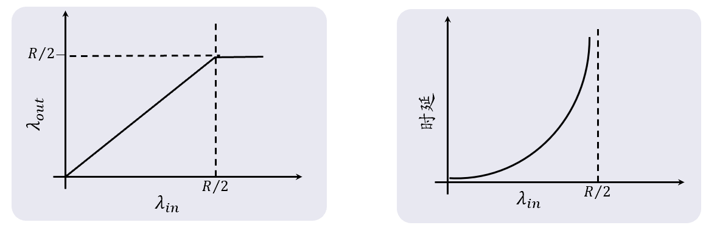

2. 两个发送方和一台具有有限缓存的路由器，发送方将原始数据发送至套接字的发送速率为$\lambda_{in}$,接收方吞吐量为$\lambda_{out}$，发送方的供给载荷即传输层向网络层发送报文段包括原始数据与重传数据为$\lambda_{in}'$。

   - 假设发送方能够以某种方式确定路由器中的缓存是否空闲，空闲时才会发送分组，则不会有丢包和重传。$\lambda_{out}=\lambda_{in}=\lambda_{in}'$

   - 发送方确定一个分组已丢失后才重传，$\lambda_{in}' = \frac{R}{2},\lambda_{out}=\frac{R}{3}$时，所发送的R/6的数据为重传数据。

     网络拥塞的代价之二是发送方必须执行重传补偿因缓存溢出而丢弃的分组。

   - 发送方提前检测到超时重传并重传在路由器队列中已被推迟但并未丢失的分组。重传的分组被接收方丢弃导致路由器资源的浪费

     网络拥塞的代价之三是发送方遇到大延迟时可能进行不必要重传导致路由器以及其他链路资源的浪费。

3. 四个发送方和多台有限缓存的路由器以及多跳路径。大流量情况下，分组在第二跳路由器被丢弃时，第一跳路由器的工作是无用的。

   网络拥塞的代价至四是当一个分组沿一条路径传输过程中被丢弃时，每个上游路由器用于转发该分组而使用的传输容量最终被浪费了。

**网络负载与均衡**：

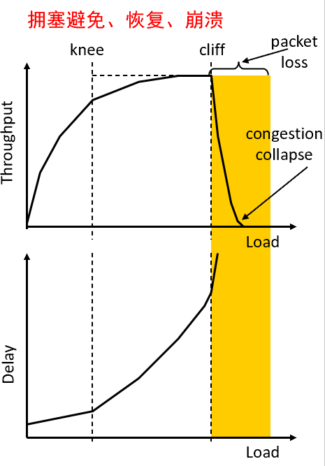

多个传输流共享网络内资源且资源需求超过网络容量时，每条流不知道当前网络资源分配状况也不知道其他流的存在，导致丢包率升高，时延增大甚至网络崩溃。

#### 8.2 TCP拥塞控制

TCP通过拥塞控制算法决定拥塞窗口cwnd(Congestion Window)的大小控制发送窗口大小控制发送速率。

#### 8.3 拥塞检测

当报文段超时或者收到多个重复的ACK作为判断拥塞的两个依据。

#### 8.4 发送速率调整

当判断网络出现拥塞时，减慢发送速率；当收到新的ACK时，增大发送速率以探测更多 的网络资源。

当连接刚建立或判断拥塞发生时，采用慢启动策略来适应可用资源；通过拥塞避免策略来根据资源变化调整发送速率，同时保证各个流获得资源的公平性。

**慢启动**：

- 基本思想：在不确定网络状况时应避免注入大量数据导致拥塞；拥塞窗口从很小的初始值开始，发送成功则快速增大以探测网络的负载能力。
- 拥塞窗口cwnd初始值设置为不超过2至4个SMSS(最大报文段)。
- 在每收到一个对新的报文段的确认后，把cwnd增加一个SMSS的数值数。(cwnd的所有报文段被确定后cwnd翻倍)

慢启动增加到一定值后会导致大量丢包，需要在大致估计到网络负载能力时，采用一种更缓和的调整机制。

**拥塞窗口的增减策略**：加性增，乘性减(AIMD),兼顾公平与效率。

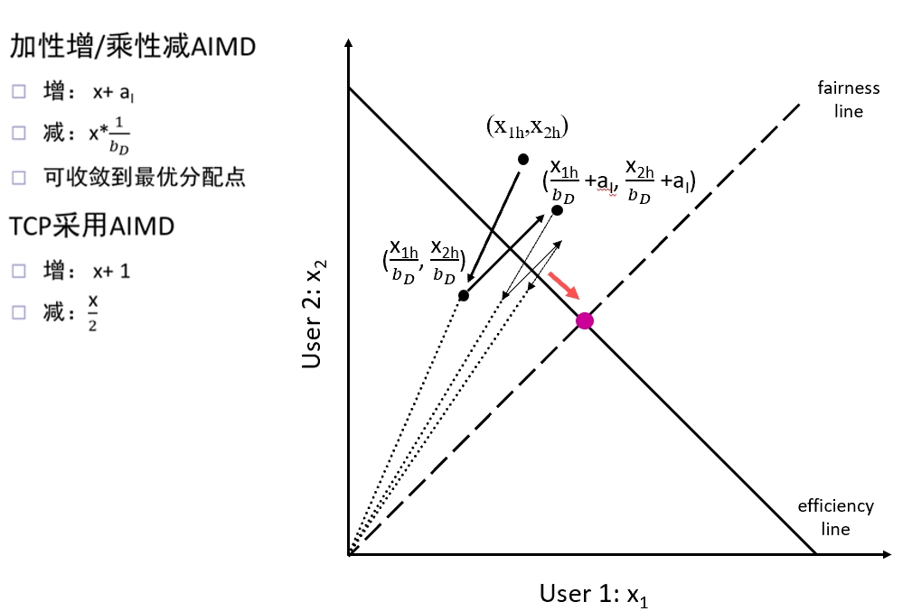

拥塞窗口增长：每收到一个新的报文段的确认后，把cwnd增加$\frac{1MSS}{cwnd}$，即cwnd内所有的报文段被确定后，cwnd才增加1。

引入慢启动门限ssthresh：当cwnd<ssthresh时，启用慢启动；cwnd>sshresh时，停止使用慢启动而改用AIMD。

**慢启动+拥塞避免算法**：

Initially：

​	cwnd = 1

​	ssthresh = initial value

New ACK received:

​	if (cwnd < sshresh):

​		cwnd = cwnd + 1

​	else:

​		cwnd = cwnd + 1/cwnd

TimeOut:

​	ssthresh = max(cwnd/2, 2)

​	cwnd = 1

//超时时ssthresh减少为cwnd的一半，cwnd为最小值，执行慢启动

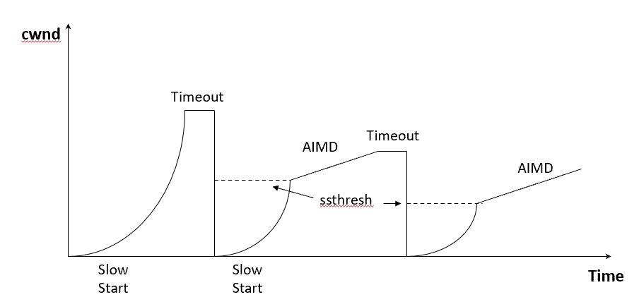

**快重传与快恢复算法**：

- 快重传：收到3个重复ACK立即触发重传。
- 快恢复：在重传之后ssthresh减小为cwnd的一半，新的cwnd = 新的ssthresh，执行AIMD。
- 在快恢复过程中出现超时，cwnd = 1，退出快恢复。

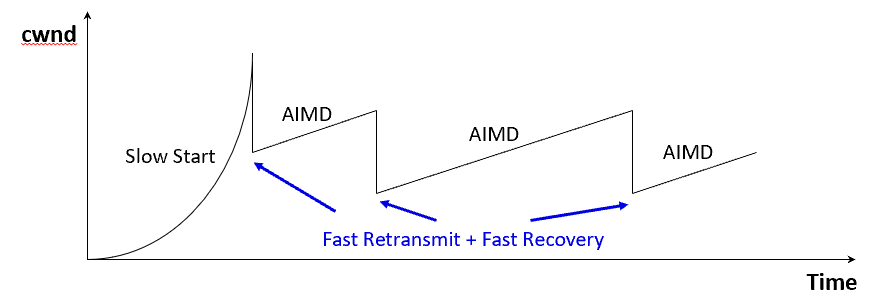

减少了慢启动，减少由于等待超时引起的连接无效时间，可以达到稳态且稳态时cwnd会在最优值附近摆动。

**TCP拥塞控制算法**：

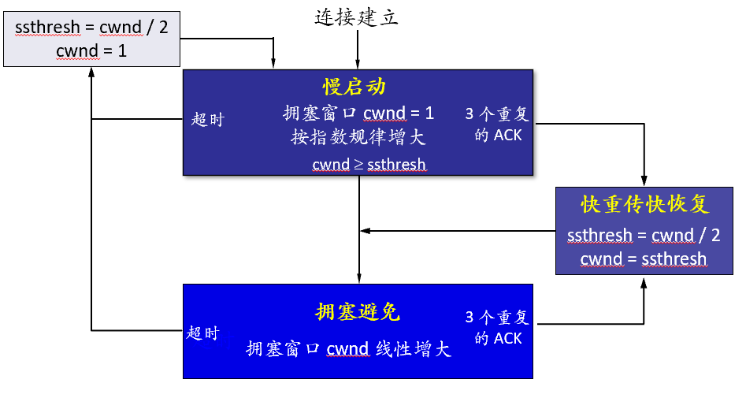

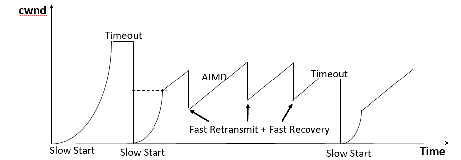

#### 8.5 网络中设备对TCP性能的影响

- buffer大小：buffer很大时可以减少丢包但会导致BufferBloat问题，即过多的缓冲导致了数据包的延迟、延迟抖动和降低了网络的总的吞吐量的现象。

  假设缓存无限大，接收方接收能力有限，需要额外消耗很多时间来消化路由器的缓存。

- 队列调度：FIFO，简单，吞吐率更高；公平排队，提升不同流之间的公平性。

- 丢弃策略：队尾丢弃(Tail Drop)，随机早检测(RED)等策略。

路由器的队列管理通常采用FIFO+TailDrop。尾部丢弃可能同时影响多条TCP连接，使这些连接在同一时间突然进入慢启动状态，即全局同步。全局同步使得全网的通信量突然下降很多，而在网络恢复正常后，通信量又突然增大很多。

**主动队列管理AQM**：在队列长度达到某个值得警惕的值时，主动丢弃到达的分组。

随机早检测REQ：维持两个参数，最小门限$TH_{min}$，最大门限$TH_{max}$。

每一个分组到达时先计算平均队列长度L：

- L  < $TH_{min}$，丢弃概率为0。
- L > $TH_{max}$，丢弃概率为1
- 否则，丢弃概率为p。