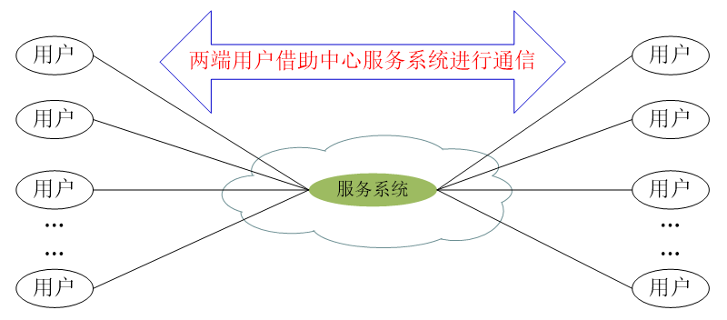

# 第六章 网络应用

## 1 基本应用模型

分为用户-用户模型(C to C简称CC模型)，用户-服务器模型(C to S，简称CS模型)。两种模型都需要服务系统的支撑。

### 1.1 CC模型

#### 1.1.1 端系统模型

在靠近用户的网络边缘分别部署端服务系统，各个段服务系统组合起来共同实现针对某一通信目的的网络应用，包括电子邮件，VPN，隧道通信等。

**特点**：

- 每个端服务系统面向用户规模有限，对服务能力要求不高。
- 应用服务两端都是用户，可以实现对用户数据管理的自主可控。
- 网络管理员能够自主控制在本地网络上的部署策略与部署成本。
- 用户可见的仅包括距自己很近的端服务系统，配置管理与更新策略容易实现。

#### 1.1.2 中心服务系统模型

网络应用的两端认仍是用户，用户之间依赖统一部署的服务系统实现应用，用户所在的网络管理员无法参与服务系统的部署与管理。

特点：

- 服务系统面向全体用户，对系统处理能力要求较高。
- 为提高系统服务能力，倾向于采用分布式部署策略，大大提升了系统复杂度和管理难度。
- 用户应用策略和用户数据统一管理，带来用户隐私泄露风险。

### 1.2 CS模型

服务系统部署于网络中，每个用户通过访问服务系统获取相应的服务数据。多用于WEB,DNS,DHCP,SNMP等用户访问目的是获取服务系统所提供的数据，用户之间不需要交互。

往往会在靠近用户侧的地方部署本地代理，作为用户访问服务系统的前端环节，来：

- 降低服务系统工作负载。
- 提升用户访问效率。
- 降低用户侧配置复杂度。
- 降低服务系统部署成本。

## 2 域名系统DNS

DNS将可读的变长的名字(www.baidu.com)与定长的数字地址(61.135.169.125:80)关联映射起来。

用户提供主机名给应用程序，程序调用DNS将主机名解析为IP地址，后续TCP，IP等通信使用IP地址。

**DNS的设计**：

- 支持域名到地址的映射查询，类似于网络层与数据链路层之间的ARP，运行于UDP之上。
- 以客户/服务器(client/server)方式工作：
  - 客户程序位于端系统，由端系统的应用进程调用。
  - 域名服务程序在专设的机器上运行，这些机器称为域名服务器。
- 层次化的命名空间：.com -> google.com -> www.google.com
- 分布式，层次化的域名空间存储和管理：根域名服务器，顶级域名服务器，权威服务器。

**层次化的域名空间**：

任何连接在互联网上的主机或路由器都有唯一域名，域名只是逻辑概念，不代表结点所在地址。

互联网采用层次树状的命名结构：域是命名空间中一个可被管理的划分。域可划分子域，形成顶级域，二级域，三级域等。

**DNS服务器**：一个DNS服务器所管辖的(或叫有权限的)范围叫做区，各单位根据具体情况来划分自己管辖的区但一个区中的所有结点必须能够联通。每一个区设置相应的权威域名服务器用来保存该区中所有主机的域名到IP地址的映射。

- 根域名服务器：最高层次的域名服务器，所有的根域名服务器都知道所有的顶级域名服务器的域名和IP地址；不管是哪一个本地域名服务器，若要对互联网上任何一个域名进行解析，只要自己无法解析，就求助于根域名服务器。共13个不同IP地址的根域名服务器，分别用a-m命名。(x.rootservers.net)
- 全球顶级域名服务器：包括一般性域名(.com, .org...)和国家地区域名(.cn, .hk..)，一般由专业机构维护管理。
- 权威域名服务器：负责一个区的域名服务器，提供一个组织内的域名与主机映射关系；通常由该组织自己维护管理。
- 本地域名服务器(递归服务器)：也被称为默认服务器，通常距离终端用户比较近，当一个主机发出DNS查询请求时，这个查询请求报文就发送给本地域名服务器。

DNS域名服务器会把数据复制到几个域名服务器来保存，其中一个是主域名服务器，其他的是辅助域名服务器；主域名服务器故障时辅助域名服务器可保证DNS查询工作不中断。

**域名解析**：

- 递归查询(第一阶段)：主机向本地域名服务器查询；若本地域名服务器不知道被查询的IP地址，那么本地域名服务器就以DNS客户的身份向其他根域名服务器继续发出查询请求报文。
- 迭代查询(第二阶段)：本地域名服务器向根域名服务器查询；当根域名服务器收到本地域名服务器的迭代查询请求报文时，要么给出所查询的IP地址，要么告诉本地域名服务器下一步应当向哪一个域名服务器进行查询，在让本地域名服务器进行后续查询。

每个域名服务器都维护一个cache，存放最近用过的名字以及何处获得名字映射的记录，并对此设置计时器，超时会被清理。当服务器回答一个查询请求时，在响应中指明绑定有效存在的时间值。

## 3 万维网

**万维网工作方式**：客户/服务器方式，客户只浏览器，服务器程序由万维网文档所驻留的计算机运行，这个计算机也成称为万维网服务器。客户程序向服务器程序发起请求，服务器程序向客户程序送回客户所需的web文档。

万维网通过使用统一资源定位符URL唯一标识Web上各种文档；基于超文本传送协议HTTP实现Web客户程序与服务器程序之间的交互；使用超文本标记语言HTML时各种文档都能在互联网上的各种计算机上显示出来同时使yoghurt知道什么地方存在超链接；通过搜索引擎使用户能很方便地找到所需的信息。

#### 统一资源定位符URL

URL是对资源的位置和访问方法的简洁描述，相当于一个文件名在网络范围的扩展，因此URL是与互联网相连的机器上的任何可访问对象的一个指针。

URL格式为<协议>://<主机>:<端口>/<路径>

协议包括文件传输协议ftp，超文本传输协议http，usenet新闻news；

主机表示存放资源的主机在互联网中的域名，端口，路径有时可省略。

#### 超文本传送协议HTTP

HTTP是面向事务的应用层协议，是无状态，无连接的虽然使用了面向连接的TCP向上提供服务。

面向事务：一系列信息交换是不可分割的整体，所有信息交换需要完整完成，否则信息交换视为不成功。(域名解析，TCP连接，http请求，获得html代码，解析html代码并请求资源，渲染呈现)

用户点击URL后发生的事件

1. 浏览器分析超链指向页面的URL；
2. 浏览器向DNS请求解析域名的IP地址；
3. 域名系统DNS解析出服务器的IP地址；
4. 浏览器与服务器建立TCP连接；
5. 浏览器发出HTTP请求报文；
6. 服务器返回HTTP响应报文；
7. 释放TCP连接；
8. 浏览器显示获取的文本；

请求一个万维网文档所需时间：2个RTT+文档传输时间。TCP三次握手中，第三次的ACK可以和HTTP请求一起发送。

HTTP使用持续连接减小响应时间，即Web服务器发送响应后一段时间内保持这条连接，分为两种工作方式：

- 非流水线方式：客户收到前一个响应才能发出下一个请求，节省TCP建立连接的一个RTT时间，但服务器端发送完一个对象后，其TCP处于空闲状态，浪费服务器资源。
- 流水线方式：客户收到一个HTTP响应之前能发送新的请求报文，服务器可连续发会响应报文，使TCP空闲时间减少，提高下载效率。

**代理服务器**：把最近的一些请求和响应暂时存在本地磁盘中，当与暂时存放的请求相同的请求到达时，万维网高速缓存就把暂存的响应发出去，不仅减少网络流量，也提升传输性能。

工作流程：

1. 浏览器访问互联网服务器时，先与Web缓存建立TCP连接并发出HTTP请求报文。
2. 若Web缓存已存放了所请求的资源，则将此对象放入HTTP响应报文中返回给浏览器。
3. 否则，Web缓存代表发出请求的用户浏览器，与互联网上的源服务器建立TCP连接，发送HTTP请求。
4. 源服务器将所请求的对象放在HTTP响应报文中返回给Web缓存。
5. Web缓存收到此对象后，复制存储在本地存储器中，再将对象放在HTTP响应报文中，通过已建立的TCP连接返回给请求该对象的浏览器。

#### HTTP报文

HTTP报文分为两类：请求报文与响应报文；报文由三部分组成：开始行，首部行与实体主体。

##### 请求报文

| 方法    | 意义                          |
| ------- | ----------------------------- |
| OPTION  | 请求一些选项的信息            |
| GET     | 请求读取URL所标志的信息       |
| HEAD    | 请求读取URL所标志的信息的首部 |
| POST    | 给服务器添加信息              |
| PUT     | 在指明的 URL下存储一个文档    |
| DELETE  | 在指明的 URL下删除一个文档    |
| TRACE   | 用来进行环回测试的请求报文    |
| CONNECT | 用于代理服务器                |

请求头部为变长可读的字符串，包括但不限于：主机，认证，用户代理，连接管理。

##### 响应报文

| 状态码 | 定义       | 说明                             | 示例                      |
| ------ | ---------- | -------------------------------- | ------------------------- |
| 1XX    | 信息       | 接收到请求，继续处理             | 100 Continue              |
| 2XX    | 成功       | 操作成功收到，理解和接受         | 200 OK                    |
| 3XX    | 重定向     | 为了完成请求，必须采取进一步措施 | 301 Moved Permanently     |
| 4XX    | 客户端错误 | 请求的语法有错误或不能完全被满足 | 404 Not Found             |
| 5XX    | 服务端错误 | 服务器无法完成明显有效的请求     | 500 Internal Server Error |

短语用于解释状态码，应答头部内容与请求头部类似。

**HTTP Cookie**:Web站点使用Cookie来追踪用户，即在HTTP服务器与客户端之间传递状态信息，服务器为用户产生一个唯一识别码Cookie，发送给客户端并由客户端保存一段时间；客户端收到后，每次请求都将Cookie发送给服务器，也可以从其他机器拷贝Cookie来继续访问服务器。

Cookie保存在浏览器中，使用该浏览器的其他用户也可以继续使用Cookie。

#### Web文档

超文本标记语言HTML用作制作Web页面的标准语言，解决页面制作标准化的问题；HTML定义许多用于排版的命令(标签)，当浏览器从服务器读取 HTML 文档后，按照 HTML 文档中的各种标签，根据浏览器所使用的显示器的尺寸和分辨率大小，重新进行排版并恢复出所读取的页面。

HTML规定了连接的设置方法，每个连接都有起点（说明页面中什么地方可以引出一个链接）和终点（远程链接终点在其他网站的页面上，需指明相关URL；本地链接终点在本地的某个文档中，需指明路径）。

#### Web信息检索

搜索引擎用于对Web中信息检索，主要分为全文检索搜索引擎和分类目录搜索引擎。

1. 全文检索搜索引擎通过搜索软件在互联网上各网站搜集信息，建立一个很大的在线数据库共用户查询，如Google，baidu。
2. 分类目录搜索引擎不采集网站的任何信息，而是利用各网站向搜索引擎提交的网站信息时填写的关键词和网站描述等信息，经过人工审核编辑后，输入到分类目录的数据库中，如垂直搜索中分类查询，行业查询等。

## 4 电子邮件

发送流程：

1. 发件人调用PC中用户代理撰写和编辑要发送的邮件。
2. 发件人的用户代理把邮件用SMTP协议发送给发送方邮件服务器。
3. SMTP服务器将邮件临时存放在邮件缓存队列中，等待发送。
4. 发送方邮件服务器的SMTP客户与接收方邮件服务器的SMTP服务器建立TCP链接，然后把邮件缓存队列中的邮件依次发送出去。
5. 运行在接收方邮件服务器的SMTP服务器进程收到邮件后，把邮件放入收件人的用户邮箱中，等待收件人进行读取。
6. 收件人在打算收信时，运行PC机中的用户代理，使用POP3或IMAP协议读取发送给自己的邮件。

电子邮件发送时使用简单邮件传送协议SMTP，读取邮件时使用邮局协议版本3POP3或互联网报文存取协议IMAP，互联网邮件信息格式为互联网文本报文格式或通用互联网邮件扩充。

**SMTP协议**：SMTP使用客户/服务器模式，客户是负责发送邮件的SMTP进程，服务器是负责接受SMTP的进程；定义了14条命令与21种应答。通信过程基于TCP，分为连接建立，邮件传送，TCP连接释放三阶段。

**POP3协议**：客户/服务器模式，客户端在接受邮件的用户的PC中运行；服务器端在用户所连接的ISP的邮件服务器中运行。

**IMAP协议**：客户/服务器模式，联机协议，PC上IMAP客户程序在打开IMAP服务器的邮箱时，用户可看到邮件首部，若需打开才将邮件传到用户的计算机上。运行收件人只读邮箱中的某一部分。缺点是如果用户没有将邮件复制到自己的PC上时，邮件会一直存放在IMAP服务器上。

**电子邮件的信息格式**：分为信封与内容两部分，信封包括首部和主体，首部包含"To","Subject","Cc","From", "Reply-To"五部分。内容类型有text, image, audio, cideo, model, application, message, multipart.

## 5 文本传送协议FTP

FTP基于TCP，简单文本传送协议TFTP基于UDP。

FTP采用客户/服务器方式，由一个主进程和若干从属进程组成，主进程负责接受新的请求，从属进程负责处理单个请求。

主进程打开熟知端口，等待客户进程发出连接请求，收到后启动从属进程处理请求并回到等待状态继续接受其它客户的请求。

用户的一次数据传输涉及两个从属进程，建立两个TCP连接：控制进程，端口号为21，控制连接不传送文件；数据传输进程，端口号为20，用于实际数据传输。

### TFTP

客户/服务器模型。端口号为69，基于UDP，需要自己的差错改正策略，没有一个庞大的命令集，没有列目录的功能，也不能对用户进行身份鉴别。

工作方式：

- 开始工作时，客户进程发送一个读请求 PDU 或写请求 PDU给 服务器进程。
- TFTP 服务器进程选择一个新的端口和 TFTP 客户进程进行通信。
- 每次传送的数据 PDU 中有 512 字节数据，也称为文件块 (block)，每个块按序编号，从 1 开始；若文件长度不为512的整数倍则最后一个不完整的文件块作为文件结束的标志；否则需发送一个只含首部而无数据的PDU。
- 实现可靠传输
  - 发送完一个文件块后等待对方的确认，确认时应指明所确认的块编号
  - 发完数据后在规定时间内收不到确认就要重发数据 PDU
  - 发送确认 PDU 的一方若在规定时间内收不到下一个文件块，也要重发确认 PDU

## 6 远程终端协议 Telnet

用户通过Telnet可在其所在地通过TCP连接登录到远地的另一主机。

使用客户/服务器方式，本地系统运行 TELNET 客户进程，而在远地主机则运行 TELNET 服务器进程，服务器中的主进程等待新的请求，并产生从属进程来处理每一个连接。

定义网络虚拟终端 NVT (Network Virtual Terminal) 屏蔽不同操作系统的差异：

客户软件把用户的击键和命令转换成 NVT 格式，送交服务器，服务器软件把收到的数据和命令，从 NVT 格式转换成其所需的格式，向用户返回数据时，服务器把其格式转换为 NVT 格式，本地客户再从 NVT 格式转换到本地系统所需的格式。

## 7 动态主机配置协议DHCP

提供即插即用连网 (plug-and-play networking) 的配置机制，允许主机加入新的网络和获取IP等配置信息，不用手工参与。

工作原理：

主机在启动时，作为客户，广播发送DHCP发现报文 (DHCPDISCOVER)；DHCP 服务器回答此广播报文，尽管本地网络上所有主机都能收到此广播；DHCP 服务器在其数据库中查找该计算机的配置信息，若找到，则返回找到的信息；找不到，则从服务器的 IP 地址池(address pool)中取一个地址分配给该计算机。

DHCP中继代理：每个网络至少有一个 DHCP 中继代理，它配置了 DHCP 服务器的 IP 地址信息。当 DHCP 中继代理收到主机发送的发现报文（DHCPDISCOVER）后，就以单播方式向 DHCP 服务器转发此报文，并等待其回答；收到 DHCP 服务器的提供报文（DHCPOFFER）后，DHCP 中继代理再将此报文发回给主机。

租用期：DHCP 服务器分配给 DHCP 客户的 IP 地址的临时的，只能在一段有限的时间内使用这个分配到的 IP 地址，这段时间称为租用期。

## 8 简单网络管理协议 SNMP

管理程序和代理程序按客户/服务器方式工作，客户程序由管理程序运行，向某个代理程序发送请求或命令，SNMP服务器程序由代理程序运行，返回响应或执行某个动作。基本功能包括监视网络性能、检测分析网络差错、配置网络设备等

有三个组成部分：SNMP本身，管理信息结构SMI，管理信息库MIB。

SMI负责被管对象应怎样命名，用来存储被管对象的数据类型有哪些种，在网络上传送的管理数据应如何编码。

MIB 是被管对象必须维持可供管理程序读写的若干控制和状态信息，管理程序使用 MIB 中这些信息的值对网络进行管理 。

SNMP操作只有读和写，通过周期性探询实现。

SNMP 不是完全的探询协议，它允许不经过询问就能发送某些信息，这种信息称为陷阱，表示它能够捕捉“事件。

SNMP基于UDP，使用熟知端口162.

## 9 系统调用和应用编程接口

应用进程通过接口接入网络，主要有套接字，Windows Socket，TLI等类型。

