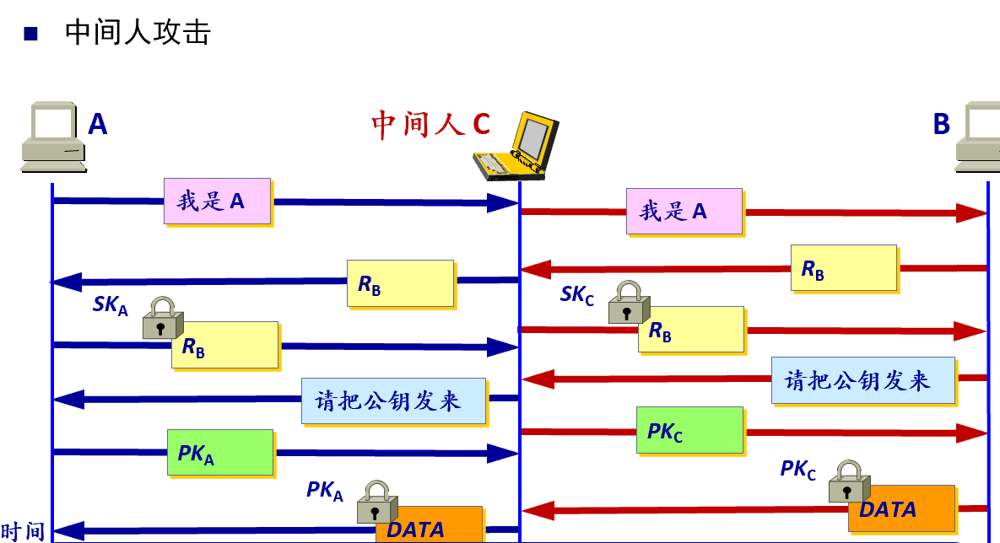
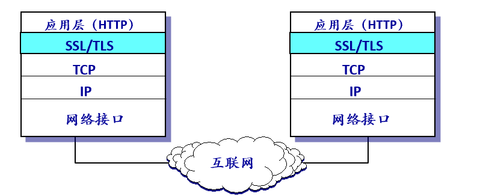
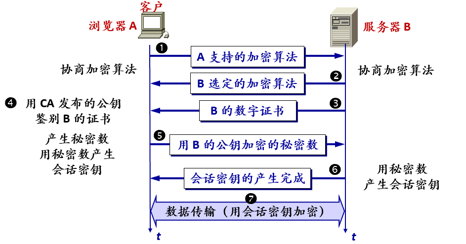
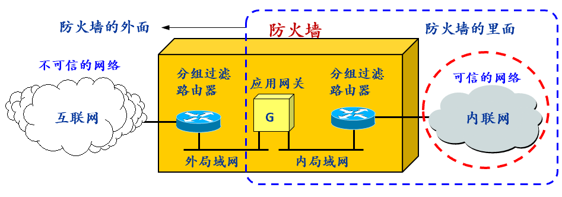

# 第七章 网络安全知识

## 1 概述

网络信息安全主要防止知识状态的改变：对信息进行窃取，使窃取者知道信息拥有者不希望他知道的事情；对信息进行破坏，使信息拥有者不在知道他本来知道的事情。

攻击分为被动攻击与主动攻击：

- 被动攻击指攻击者从网络上窃听他人的通信内容，通常把这类攻击称为截获。被动攻击中攻击者只观察分析数据包但不干扰信息流。又被称为流量分析。
- 主动攻击分为篡改，恶意程序，拒绝服务。
  - 篡改指故意篡改网络上传送的报文，有时也称为更改报文流。
  - 恶意程序种类繁多，对网络安全威胁较大的主要包括：病毒、蠕虫、特洛伊木马、逻辑炸弹、后门入侵、流氓软件等。
  - 拒绝服务指攻击者向互联网上的某个服务器不停地发送大量分组，使该服务器无法提供正常服务，甚至完全瘫痪。

**计算机网络通信的安全目标**：

- **机密性**：除了收发双方之外，任何其他截获这些信息的人无法从字面上解读、也无法凭借现阶段可获得的计算资源将原文还原，只有共享秘密的接收方才能够正确解密并阅读。
- **完整性**：通过对原文进行的某种操作，得到原文的一个“忠实的”缩影。在现阶段可以获得的计算资源条件下，对原文的任何一点改动，都会导致相应缩影的改动，以此来保证接收方收到的信息恰恰就是发信方发出的原文，没有经过任何篡改和破坏。
- **真实性**：通过对原文进行的某种操作，得到发信方在原文上的一个“签名”。一个在现阶段可以获得的计算资源条件下，这个签名很容易验证但很难模仿，以此来确认接收到的信息确实是发信方发的，不是别人仿冒的。
- **不可抵赖性**：通过上述的“签名”，来确认发信方确实发了接收方收到的信息。不能否认：在现阶段可以获得的计算资源条件下，如果不是发信方发的，将无法解释接收方何以能够收到具有那样“签名”的信息（数学上保证：别人无法伪造一个签名）

**密码**：对信息的一种编码和解码手段，通过数学原理保证了知道某个关键秘密的人之间可以使用这种手段在有敌人、敌对势力存在的通信环境中安全地、放心地通信，而不知道这个关键秘密的第三方却不可能有足够的计算资源破译他们之间的通信或交易的内容。

**理论上不可破**：如果不论截取者获得了多少密文，但在密文中都没有足够的信息来唯一地确定出对应的明文，则这一密码体制称为无条件安全的，或称为理论上是不可破的

**计算上安全**：如果密码体制中的密码不能被可使用的计算资源破译，则这一密码体制称为在计算上是安全的

¨加密和解密用的密钥*K* (key) 是一串秘密的字符串（即比特串），明文通过加密算法 E 和加密密钥 *K* 变成密文，n接收端利用解密算法 D 运算和解密密钥 *K* 解出明文 X。

## 2 加密体制

### 对称密钥密码体制

加密密钥与解密密钥相同的密码体制，优点是效率高，易实现；缺点是密钥的分发和管理不易。

## 公开密钥密码体制 (公钥密码体制)

非对称密钥密码体制，即加密密钥与解密密钥不同，加密密钥 (即公钥) PK 是公开的，而解密密钥 (即私钥或密钥) SK 是需要保密的；由已知加密密钥 PK 推导出解密密钥 SK 在计算上是不可行的；加密算法 E 和解密算法 D 也都是公开的。

加密密钥是公开的但不能用于解密，加密与解密的算法是互逆的，加密和解密运算可以互调。

## 3 数字签名

基于公钥体制实现数字签名

- 源认证：除 A 外没有别人能具有 A 的私钥，所以除 A 外没有别人能产生这个密文，因此 B 相信报文 X 是 A 签名发送的。

- 不可抵赖性：若 A 要抵赖曾发送报文给 B，B 可将明文和对应的密文出示给仲裁者，仲裁者很容易用 A 的公钥去证实 A 确实发送 X 给 B。

- 防伪造、防篡改：若 攻击者 将 X 伪造成 X‘，则 攻击者无法用A的私钥进行签名， 验证失败，证明此报文已经不可靠（完整性遭到破坏）。

## 4 认证

认证使得通信的接收方能够验证所收到的消息 (发送者、消息内容、发送时间、序列等) 的真伪。

认证分为；两类

- 消息认证即认证所收到的消息的确是消息的发送者所发送的，而不是其他人伪造或篡改的，这就包含了端点认证和消息完整性认证

- 实体认证即端点认证，仅仅认证发送消息的实体，实体可以是一个人，也可以是一个进程 (客户或服务器)

**密码散列函数**：要找到两个不同的消息，它们具有同样的密码散列函数输出，在计算上是不可行的，因此，密码散列函数可以认为是一种单向的。常见的有MD5，SHA-1.

**消息认证码MAC**：密码散列函数可以防篡改，但不能防伪造；可采用MAC，对散列进行一次加密（对称密码）或签名（非对称密码）。

在实体认证时使用nonce：Nonce，一个不重复使用的大随机数，即“一次一数”。在使用公钥密码体制时，可以对nonce签名认证但存在中间人攻击。

## 5 密钥管理

### 5.1对称密钥分配

**密钥分配中心 KDC (Key Distribution Center)**:

KDC 是大家都信任的机构，任务是给需要进行秘密通信的用户临时分配一个会话密钥 (仅使用一次)

流程：

- 用户 A 向密钥分配中心 KDC 发送时用明文，说明想和用户B通信。在明文中给出 A 和 B在 KDC 登记的身份。
- KDC 用随机数产生“一次一密”的会话密钥 KAB 供 A 和 B 的这次会话使用，向 A 回复消息，该应答消息用 A 的主密钥 KA 加密，该消息中包含密钥 KAB 和请 A 转给 B 的一个票据(ticket)，它包含 A 和 B 在 KDC 登记的身份，以及这次会话将要使用的密钥 KAB；该票据用B的主密钥 KB 加密，因此 A 无法知道此票据的内容。
- B 收到 A 转来的票据并使用自己的密钥 KB 解密后，就知道 A 要和他通信，同时也知道 KDC 为这次和 A 通信所分配的会话密钥 KAB

### 5.2 非对称密钥分配

**认证中心 CA**：一个值得信赖的机构，将公钥与其对应的实体（人或机器）进行绑定(binding)。

## 6 互联网使用的安全协议

### 6.1 网络层安全协议

在IP中增加扩展报头 或 选项，传输消息摘要、签名等信息

### 6.2 传输层安全协议

安全套接字层 SSL (Secure Socket Layer)：作用在端系统应用层的 HTTP 和传输层之间，在 TCP 之上建立起一个安全通道，为通过 TCP 传输的应用层数据提供安全保障。

IETF 在 SSL 3.0 基础上推出了 TLS，为所有基于 TCP 的网络应用提供安全数据传输服务.

SSL / TLS ¨建立在可靠的 TCP 之上，与应用层协议独立无关。在发送方，SSL 接收应用层的数据，对数据进行加密，然后把加密后的数据送往 TCP 套接字。在接收方，SSL 从 TCP 套接字读取数据，解密后把数据交给应用层。

SSL安全会话建立过程:

### 6.3 应用层的安全协议

PGP :一个完整的电子邮件安全软件包，包括加密、鉴别、电子签名和压缩等技术。

**发送方 A 的 PGP 处理过程**：

1. 明文邮件 *X* 进行 MD5 运算，得出消息摘要 *H*；用 A 的私钥对 *H* 进行加密 (即数字签名)，得出消息认证码 MAC，把它拼接在明文 *X* 后面，得到扩展的邮件 (*X*, MAC)。
2. 使用 A 自己生成的一次性密钥对扩展的邮件 (*X*, MAC)进行加密。
3. 用 B 的公钥对 A 生成的一次性密钥进行加密。
4. 把加密的一次性密钥和加密的扩展的邮件发送给 B 。

**接收方 B 的 PGP 处理过程**：

1. 把加密的一次性密钥和加密的扩展邮件 (*X*, MAC)分离开。
2. 用 B 自己的私钥解出 A 的一次性密钥。
3. 用解出的一次性密钥对消息进行解密，分离出明文 *X* 和 MAC。
4. 用 A 的公钥对 MAC 进行解密 (即验证签名)，得出消息摘要 *H*。
5. 对明文邮件 *X* 进行 MD5 运算，得出另一个摘要 *H*(*X*)；比较 *H*(*X*) 和 *H* ，若一样，则对邮件的发送方的认证通过，报文的完整性也得到证实。

## 7 系统安全与安全防护思路的变化

### 7.1 防火墙

防火墙的功能：阻止，即阻止某种类型的通信量通过防火墙 (从外部网络到内部网络，或反过来)；允许，功能与“阻止”恰好相反。

防火墙主要采用分组过滤路由器以及应用网关，也称代理服务器(proxy server)技术。

### 7.2 入侵检测系统 IDS (Intrusion Detection System)

IDS 能够在入侵已经开始，但还没有造成危害或在造成更大危害前，及时检测到入侵，以便尽快阻止入侵，把危害降低到最小。有基于特征的 IDS以及基于异常的 IDS。

### 7.3安全防护思路的变化

防护目标：通道安全到数据安全

识别检测能力：大数据、AI技术辅助

安全策略：静态部署到动态生成

网络安全：平等自治、自主可控、按需部署