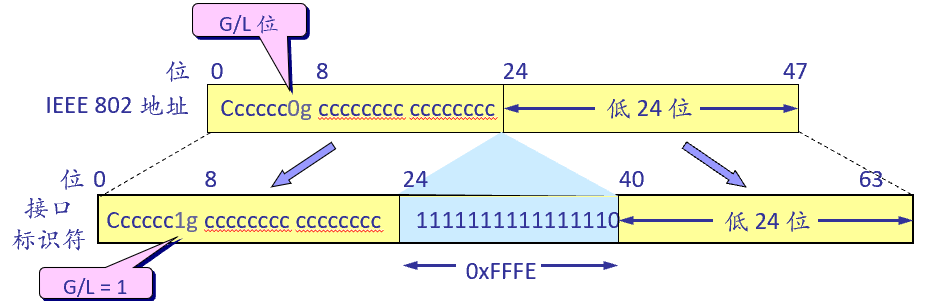

# 第八章 下一代互联网协议 IPv6

## 1 概述

IPv6 --下一代互联网协议 (IPng) 的一个具体提案：

- 近乎无限的地址空间：128位 = 340万亿万亿万亿个地址，分层地址结构，改进地址聚合能力。
- 简化首部格式：简化了IP分组首，包含8个字段 (IPv4是12个字段)；IPv6 首部改为 8 字节对齐，首部长度必须是 8 字节的整数倍。
- 网络层认证和加密
- 更高的服务质量保证
- 真正的即插即用功能：因此 IPv6 不需要使用DHCP。
- 可移动性的真正实现

## 2 首部结构

IPv6 将首部长度变为固定的 40 字节，称为基本首部 (base header)；在基本首部的后面允许有零个或多个扩展首部，所有的扩展首部和数据合起来叫做数据报的有效载荷(payload)或净负荷 。

目前IPv6协议中已经定义的扩展首部：逐跳选项报头（Hop By Hop Header，HBH），目的选项报头（Destination Option Header，DOH），路由报头（Routing Header，RH），也称为选路报头，分段报头（Fragment Header，FH），身份认证报头（Authentication Header，AH），载荷安全封装报头（Encapsulated Security Payload Header，ESP）等，移动报头（Mobility Header，MH）。

扩展首部必须通过前一个首部的下一个头字段来确认。

## 3 地址模型

地址有范围：Link Local，Site Local，Global。

Link Local和Site Local：不需要验证目的地址是否与自己同一网段。

冒号十六进制记法：以16位为一分组，每个16位分组写成4个十六进制数，中间用冒号分隔。

零压缩机制：某些地址中包含很长的零序列，用双冒号“::”表示，只能用一次。

IPv6 扩展了地址的分级概念，全球路由选择前缀，占 48 位；子网标识符，占16 位；接口标识符，占 64 位。

IEEE定 义了一个标准的 64 位全球唯一地址格式 EUI-64:前三个字节为公司标识符，但后面的扩展标识符是五个字节;较为复杂的是当需要将 48 位的以太网硬件地址转换为 IPv6 地址.

## 4 自动配置

地址配置步骤

- 根据48位MAC地址生成64位接口标识符

- 生成链路本地地址并验证唯一性

- 接收路由器宣告消息，获取64位前缀信息

- 拼接获得128位地址全局地址

- 验证地址的唯一性

## 5 本地通信 

同一链路上的IPv6节点基于邻居发现协议

- 探测彼此存在

- 解析链路层地址

- 发现默认路由器及本地前缀

- 维护邻居节点的可达性信息

- 路由重定向

邻居缓存为每个邻居保存一个列表条目，用来存放节点近期访问过的邻居节点;每个列表条目包含一个在线单播IPv6地址和相关的链路层地址，一个用来说明此邻居是否是路由器标志位，一个等待传输的数据包的指针.

目的缓存包含节点近期访问过的每一个节点地址，包括一个IPv6地址和一个指向邻居缓存的指针，邻居缓存中包含了节点到达目的地址所需的下一跳地址。

前缀列表包含每一个在线的前缀，用来决定一个地址是否在线，有效期既有有限的也有无限的，链路本地前缀就具有无限制的有效期。

默认路由器列表包含所有可作为默认路由器的路由器列表条目；列表条目包含一个指向邻居缓存的指针，邻居缓存中包含默认路由器的IPv6地址和链路层地址、状态标志位；列表条目从路由器宣告消息中得到一个失效时间值。

## 6 超长数据传送

IPv6 把分片限制为由源站来完成，动态发现路径最大传输单元的方法，不允许中间分段。

## 7 **IPv4** 向IPv6的过渡策略

###  双协议栈

主机和路由器在同一网络接口上运行IPv4栈和IPv6栈

### 隧道

在 IPv6 数据报要进入IPv4网络时，把 IPv6 数据报封装成为 IPv4 数据报，整个的 IPv6 数据报变成了 IPv4 数据报的数据部分;当 IPv4 数据报离开 IPv4 网络中的隧道时，再把数据部分（即原来的 IPv6 数据报）交给主机的 IPv6 协议栈。

### NAT-PT

IP网络地址翻译器 (NAT) 的地址翻译机制和无状态IP/ICMP翻译器 (SIIT) 的v6/v4协议翻译机制的结合。